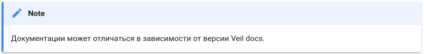

# Синтаксис Markdown разметки в документации

Документация разработана с использованием [GitHub Flavored Markdown](https://github.github.com/gfm/)(GFM)

## Содержание

- [Базовые возможности GFM](#--markdown-basic-markdown)
    - [Заголовки](#-headings)
    - [Полужирный шрифт и курсив](#----emphasis)
    - [Списки](#-lists)
        - [Простой неупорядоченный список](#---unordered-list)
        - [Вложенный неупорядоченный список](#---unordered-sublist)
        - [Простой упорядоченный список](#---ordered-list)
        - [Вложенный упорядоченный список](#---ordered-sublist)
    - [Таблицы](#-tables)
    - [Ссылки](#-links)
    - [Оформление кода](#--code)
        - [Фрагмент кода как часть предложения](#-----inline-code)
        - [Фрагмент кода отдельным блоком](#----codeblock)
    - [Изображения](#-images)
    - [Экранирование](#-shield)
- [Расширения для Markdown](#--markdown-extensions)
    - [Примечания](#-notes)
    - [Оглавление документа](#--doc-toc)
    - [Маркировка текста маркером](#mark-highlight)
    - [Перечеркивание текста](#tilde-tilde)
    - [Маркировка текста](#caret-caret)
    
##Базовые возможности Markdown {#basic-markdown}

### Заголовки {#headings}

Для обозначения заголовка используется символ `#`. Пример синтаксиса:

```markdown
# Заголовок 1 уровня
## Заголовок 2 уровня
### Заголовок 3 уровня
#### Заголовок 4 уровня
```

В документации используется 4 уровня заголовков.
Первый заголовок на странице — 1 уровня. Для заголовков подразделов можно использовать 2, 3 и 4 уровни.

### Полужирный шрифт и курсив {#emphasis}

Для выделения текста **полужирным шрифтом** используется удвоенный символ `*`:

```markdown
Этот текст выделен **полужирным шрифтом**.
```

Для выделения текста _курсивом_ используется символ `_`:

```markdown
Этот текст выделен _курсивом_.
```

Для выделения текста _**полужирным шрифтом и курсивом**_ используются одновременно удвоенный символ `*` и символ `_`:

```markdown
Этот текст выделен _**полужирным шрифтом и курсивом**_.
Этот текст выделен **_полужирным шрифтом и курсивом_**.
```

### Списки {#lists}

#### Простой неупорядоченный список {#unordered-list}

Чтобы оформить неупорядоченный маркированный список, можно использовать символы `*`, `-` или `+`.

Например, следующая разметка:

```markdown
* Элемент 1
* Элемент 2
* Элемент 3
```

будет отображаться так:

* Элемент 1
* Элемент 2
* Элемент 3

#### Вложенный неупорядоченный список {#unordered-sublist}

Чтобы оформить вложенный неупорядоченный список, нужно добавить отступ в начале строк с элементами вложенного списка. Допустимый размер отступа — от двух до пяти пробелов. Рекомендуемый размер отступа — три пробела.

Например, следующая разметка:

```markdown
- Элемент 1
   - Элемент A
   - Элемент B
- Элемент 2
```

будет отображаться так:

- Элемент 1
   - Элемент A
   - Элемент B
- Элемент 2


#### Простой упорядоченный список {#ordered-list}

Чтобы оформить упорядоченный список, нужно использовать цифры с символом `.` или `)`.
В документации для всех элементов списка используется цифра `1` и символ `.`.

Например, следующая разметка:

```markdown
1. Первый пункт
1. Второй пункт
1. Третий пункт
```

будет отображаться так:

1. Первый пункт
1. Второй пункт
1. Третий пункт

#### Вложенный упорядоченный список {#ordered-sublist}

Чтобы оформить вложенный упорядоченный список, нужно добавить отступ в начале строк с элементами вложенного списка.
Допустимый размер отступа — от трех до шести пробелов. Рекомендуемый размер отступа — три пробела.

Например, следующая разметка:

```markdown
1. Первый пункт
   1. Вложенный пункт
   1. Вложенный пункт
1. Второй пункт
```

будет отображаться так:

1. Первый пункт

   1.1. Вложенный пункт<br>
   1.2. Вложенный пункт
1. Второй пункт

### Таблицы {#tables}

Таблица состоит из одной строки с заголовками, разделительной строки и некоторого количества строк с данными.

Каждая строка таблицы состоит из ячеек, отделенных друг от друга символами `|`.

В ячейках разделительной строки используются только символ `-` и, возможно, символ `:`. Символ `:` ставится в начале, в конце или с обеих сторон содержимого ячейки разделительной строки, чтобы обозначить выравнивания текста в соответствующем столбце по левой стороне, по правкой стороне или по центру соответственно.

Таблицу нужно отделять от предшествующего и последующего текста пустыми строками.

Например, следующая разметка:

```markdown
По левому краю | По правому краю | По центру
:--- | ---: | :---:
Текст | Текст | Текст
```

будет отображаться так:

По левому краю | По правому краю | По центру
:--- | ---: | :---:
Текст | Текст | Текст

### Ссылки {#links}

Ссылка состоит из двух частей:
  * `[текст]` — текст ссылки.
  * `(ссылка)` — URL или путь до файла, на который делается ссылка.

Например, следующая разметка:
```markdown
[ссылка на README.md](README.md)
```

будет отображаться так:

[ссылка на README.md](README.md)

### Оформление кода {#code}

Фрагмент кода можно оформить как часть предложения или как отдельный блок.

#### Фрагмент кода как часть предложения {#inline-code}

Чтобы оформить фрагмент кода как часть предложения, нужно использовать символ <code>`</code>.

Например, следующая разметка:

```markdown
Предложение с `фрагментом кода`.
```

будет отображаться так:

Предложение с `фрагментом кода`.

#### Фрагмент кода отдельным блоком {#codeblock}

Чтобы оформить фрагмент кода как отдельный блок, нужно использовать утроенный символ <code>`</code> 
и имя соответствующего языка программирования.

Например, следующая разметка:
```markdown
    ```python
    var = 15
    ```
```

будет отобраться как фрагмент кода с подсветкой:
```python
var = 15
```

### Изображения {#images}

Чтобы вставить в текст изображение, нужно использовать следующую разметку:

```markdown

```

В документации все изображения хранятся в папках с именем `_assets`:
  * Изображениями, которые используются во многих документах, помещаются в папки `ru/_assets` и `en/_assets`.
  * Изображения, которые используются только в одном документе, помещаются в `_assets` в папке соответствующего документа.

### Экранирование {#shield}

Для экранирования служебных символов Markdown нужно использовать обратный слеш \

## Расширения для Markdown {#extensions}

### Примечания {#notes} 

Чтобы строки попали в примечание, необходимо их писать сразу после примечания, не отделяя пустой строкой.
Плюс надо отделять табуляцией.

В документации используются следующие типы примечаний:
* Примечание:
```
!!! note "Примечание"
    Документации может отличаться в зависимости от версии VeiL docs.
```

После сборки текст будет выглядеть так:


* Предупреждение
```
!!! warning "Предупреждение"
    Документации может отличаться в зависимости от версии VeiL docs.
```

* Совет
```
!!! tip "Совет"
    Документации может отличаться в зависимости от версии VeiL docs.
```

* Важная информация
```
!!! attention "Внимание"
    Список команд может отличаться в зависимости от версии CLI.
```
  
Варианты: 
- note
- seealso
- abstract
- summary
- tldr
- info
- todo
- tip
- hint
- important
- success
- check
- done
- question
- help
- faq
- warning
- caution
- attention
- failure
- fail
- missing
- danger
- error
- bug
- example
- snippet
- quote
- cite

Можно использовать вместо `!!!`  `???`, тогда подсказка будет раскрывающаяся.

Перед текстом примечания и после него обязательно оставлять пустую строку.

### Оглавление документа {#doc-toc}

* Только файлы, указанные в `toc.yaml`, обрабатываются при сборке документации и отображаются на сайте.
* Навигация по документу генерируется на базе `toc.yaml`.

### Mark {#highlight}

Mark adds the ability to highlight text like it was marked with a text marker.
The portion of text that should be highlighted must be enclosed in two equal signs `==...==.`

==лоалора==

### Tilde {#tilde}
Tilde provides an easy way to strike through cross out text.
The portion of text that should be erased must be enclosed 
in two tildes `~~...~~` and the extension will take care of the rest.

~~asdgasdg~~

### Caret {#caret}
Caret makes it possible to highlight inserted text.
The portion of text that should be marked as added must be enclosed in two carets ^^...^^.
 
^^DSFGASDF^^ 
 
 ### Использование одинакового текста в разных файлах Not ready!!!{#includes}

Чтобы использовать один и тот же текст в нескольких местах одного файла или в разных файлах, нужно:
* Сохранить такой текст в отдельном файле в папке `ru/_includes` или `en/_includes`.
* Добавить ссылку на файл с текстом в нужном месте документа с помощью расширения `include`:


Ссылка на файл обрабатывается при сборке документации для отображения на сайте и вместо ссылки подставляется содержимое файла.

### Вкладки Not ready!!!{#tabs}

Чтобы оформить текст в виде вкладок, нужно использовать следующую разметку:

### Переменные Not ready!!!{#vars}