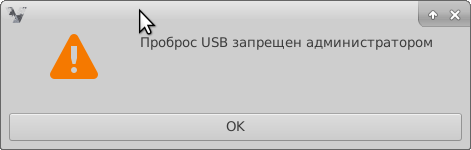
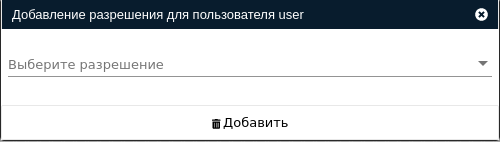
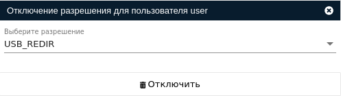

# Разрешения

!!! note "Примечание"
    Добавлено в версии VeiL Broker 3.0.0

1. Разрешения на действия пользователей при работе с VeiL Connect. 
1. Разрешениями могут обладать пользователи и группы.  
1. При создании нового пользователя он по умолчанию обладает всеми разрешениями.
1. Разрешение, выданное группе, распространяется на всех ее пользователей. 
1. При попытке произвести действие, на которое отсутствует разрешение, пользователю будет сообщено о запрете.

!!! example ""
    

## Возможные разрешения

- ### USB_REDIR

Разрешение на перенаправление USB устройств.

- ### FOLDERS_REDIR

Разрешение на перенаправление папок.

- ### SHARED_CLIPBOARD

Разрешение на использование общего буфера обмена.

## Добавление разрешений

- Перейдите на вкладку **Настройки** -> **Пользователи** (**Группы**) и выберите пользователя (группу).
- Перейдите на вкладку **Разрешения** и нажмите кнопку **Добавить разрешение**.
- В открывшемся окне выберите необходимы разрешения и нажмите кнопку **Добавить**.

!!! example ""
    

## Удаление разрешений

- Перейдите на вкладку **Настройки** -> **Пользователи** (**Группы**) и выберите пользователя (группу).
- Перейдите на вкладку **Разрешения** и нажмите кнопку **Отключить разрешение**.
- В открывшемся окне выберите необходимы разрешения и нажмите кнопку **Отключить**.

!!! example ""
    