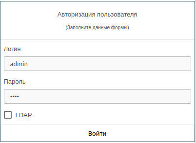

# Система управления доступом

## Конфигурируемые опции
Опции, уникальные для каждой установки, находятся в файле **/opt/veil-vdi/app/common/local_settings.py**

### Основные параметры системы управления доступом
```
AUTH_ENABLED = True  # При False отключает проверку токенов, открывает для входа стандартный интерфейс GraphQL. Исключительно для отладки.
LOCAL_AUTH = True  # Локальная система управления доступом без учета системной (PAM)
PAM_AUTH = not LOCAL_AUTH  # Использование системы управления доступом Linux. Взаимоисключающий с LOCAL_AUTH параметр.
EXTERNAL_AUTH = True  # Использование внешней службы авторизации (LDAP).
```

!!! info "Примечание"
    В настоящий момент интеграция с ОС выполняется за счет пакета veil-aio-au, который позволяет задействовать 
    встроенные механизмы ОС. Если одномоментная нагрузка на службу авторизации ожидается высокой, рекомендуется 
    воспользоваться внешней службой авторизации, например, 
    [Расширенная интеграция Active Directory](../active_directory/info.md).

### Дополнительные параметры системы управления доступом

#### Дополнительные настройки PAM
Ниже перечислены используемые команды для интеграции с ОС. 
При необходимости переопределить поведение достаточно заменить пути до исполняемых команд.
```
PAM_TASK_TIMEOUT = 5  # Время ожидания ответа от вызываемых в системе команд
PAM_USER_ADD_CMD = "/usr/sbin/vdi_adduser_bi.sh"  # Команда создания пользователя
PAM_GROUP_ADD_CMD = "/usr/sbin/vdi_addgroup_bi.sh"  # Команда добавления группы
PAM_USER_EDIT_CMD = "/usr/sbin/vdi_edituser_bi.sh"  # Команда редактирования пользователя
PAM_USER_SET_PASS_CMD = "/usr/sbin/vdi_set_pass_bi.sh"  # Команда задания пароля пользователю
PAM_CHECK_IN_GROUP_CMD = "/usr/sbin/vdi_check_in_group_bi.sh"  # Команда проверки нахождения пользователя в группе
PAM_USER_REMOVE_CMD = "/usr/sbin/vdi_remove_user_group_bi.sh"  # Команда удаления пользвателя из группы
PAM_SUDO_CMD = "/usr/bin/sudo"  # Команда запуска sudo
PAM_KILL_PROC_CMD = "/usr/sbin/vdi_kill_proc_bi.sh"  # Команда завершения процесса (при превышении времени ожидания)
PAM_USER_GROUP = "vdi-web"  # Группа в которой находятся обычные пользователи
PAM_SUPERUSER_GROUP = "vdi-web-admin"  # Группа членство в которой делает администратором
```

!!! note "Примечание"
    Следует учитывать, что команды должны иметь атрибут **+x** и быть прописаны в **sudoers**.

#### Настройки JWT
В большинстве случаев настройки являются оптимальными, однако, при необходимости, можно изменить стандартное поведение,
переопределив в **local_settings.py** параметры описанные ниже:
```
JWT_EXPIRATION_DELTA = 86400
JWT_OPTIONS = {
    "verify_signature": True,
    "verify_exp": True,
    "verify_nbf": False,
    "verify_iat": True,
    "verify_aud": False,
}
JWT_AUTH_HEADER_PREFIX = "JWT"
JWT_ALGORITHM = "HS256"
```

## Вход в систему

Вход в систему возможен двумя способами:

-  с использованием локальной учетной записи (переключатель **LDAP** выключен);
   
!!! note "PAM"
    По умолчанию после установки VeiL Broker параметр PAM_AUTH активирован, поэтому под локальным пользователем имеется
    в виду пользователь состоящий в группах vdi-web ОС, созданный в ОС и БД брокера.
   
- с использованием внешней учетной записи (переключатель **LDAP** включен).

!!! example "Вход в систему с использованием локальной учетной записи"
        

!!! note "Примечание" 
    По умолчанию двухфакторная аутентификация отключена для всех пользователей.
    Если для пользователя она была включена заранее (пользователь отсканировал QR код с помощью любого стороннего 
    [приложения-аутентификатора](../faq/2fa.md), поддерживающего функцию генерации одноразовых паролей (OATH TOTP)), 
    то при авторизации необходимо будет также помимо логина и пароля ввести 6-значный одноразовый пароль, который 
    генерируется сторонним [приложением-аутентификатором](../faq/2fa.md).

!!! note "Внешние учетные записи"
    Для использования внешних учетных записей необходимо настроить интеграцию с 
    [Службой каталогов](../active_directory/info.md).
    При успешном входе с использованием внешней учетной записи будет создан локальный профиль.
    После процедуры сброса пароля его можно будет использовать как локальную учетную запись. 

!!! info "Активные сессии"
    Одновременно у пользователя может быть только одна активная сессия. После прохождения процедуры аутентификации ранее
    выданные сессионные ключи блокируются (уникальность считается по пользователю, независимо от
    типа подключения).


## Модель разрешений

Модель разрешений состоит из 3 ключевых моментов:

   - [Роли](./roles.md);
   - [Группы](./groups.md);
   - [Пользователи](./users.md).

!!! note "Ключевые моменты"
    1. Взаимоисключающие разрешения исключены. 
    1. Роль **пользователя** всегда имеет преимущество над ролью **группы**.
    1. Итоговые роли пользователя формируются из пересечения пользовательских и всех групповых ролей пользователя.
    1. Переключатель **Администратор** дает пользователю обладание всеми возможными ролями в системе, 
       независимо от фактически назначенных ролей на него или его группы. Используйте такие типы пользователя с 
       осторожностью, их поведение аналогично **root**.
