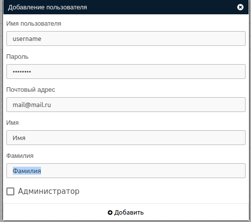
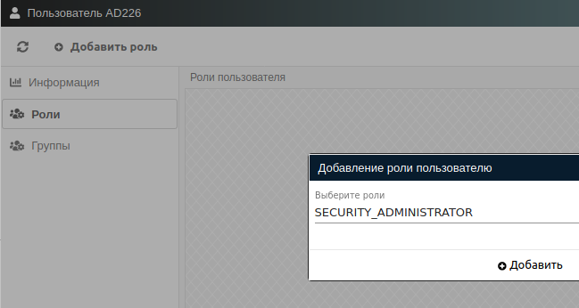
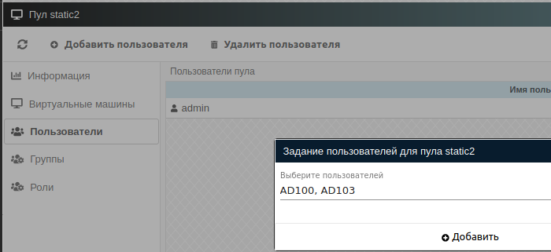

# Пользователи

**Пользователи** - это наименьшая сущность владения объектами. Обычно, закрепление объекта за конкретным пользователем
означает персональную его принадлежность, например, ВМ.

!!! warning "Администратор"
    Пользователи с атрибутом **Администратор** имеют доступ ко всем объектам системы, но, если ВМ была выдана 
    конкретному пользователю, доступ к ней можно получить только переназначением ее на **Администратора**.

## Добавление пользователя

!!! note "Примечание"
    Пользователь может быть создан с помощью синхронизации. Описание находится в 
    разделе [синхронизация пользователей](../active_directory/ad_extend.md).

!!! info "PAM"
    При активированной опции PAM_AUTH на ОС Astra Linux пользователи будут также создаваться в системе в соответствии
    со сценарием, описанным в **/usr/sbin/vdi_adduser_bi.sh**. Стандартный сценарий добавляет пользователя в группу vdi-web
    (PAM_USER_GROUP) и задает ему атрибуты --disabled-login, --no-create-home, --shell /sbin/nologin.

!!! warning ""
    Для упрощения синхронизации LDAP команда `vdi_adduser_bi.sh` содержит флаг `--force-badname`. Если синхронизация не
    планируется или система содержит требуемые настройки, то команду следует оптимизировать под нужды пользователя.

Добавление пользователя производится с помощью кнопки **Добавить пользователя** в разделе **Настройки -> Пользователи**.
В открывшемся окне необходимо заполнить следующие поля:

   - Имя пользователя (обязательное поле, при PAM должно быть уникальным и для локальной ОС);
   - Пароль (обязательное поле, при PAM должно соответствовать правилам пароля в локальной ОС);
   - Почтовый адрес (необязательное поле);
   - Имя (необязательное поле);
   - Фамилия (необязательное поле);
   - Администратор.

!!! warning "атрибут Администратор"
    При включенном PAM_AUTH пользователь будет также включен в группу vdi-web-admin (PAM_SUPERUSER_GROUP).
    Используйте переключатель с осторожностью. Лучшим выбором будет создать [Группу](./groups.md) с определенным 
    набором [Ролей](./roles.md), чем давать доступ ко всем объектам системы.

!!! example "Пример формы создания"
    

## Информация о пользователе

В информации пользователя доступна следующая информация:

   - Дата создания пользователя;
   - Дата изменения атрибутов пользователя;
   - Дата последней успешной авторизации пользователя;
   - Статус пользователя.

!!! info "Статус пользователя"
    Пользователи в статусе отличном от **Активный** не имеют возможности входа в систему.

Чтобы закрепить [Роль](./roles.md) за пользователем, необходимо нажать кнопку **Добавить роль** в разделе **Роли**
ранее созданного пользователя.

!!! example "Пример закрепления роли за пользователем"
    

!!! note "Примечание"
    Пользователь может быть включен в группу в результате синхронизации со службой каталогов. Подробности описаны в 
    в разделе [синхронизация пользователей](../active_directory/info.md).

Закрепление [Роли](./roles.md) за **Группой** производится аналогично в разделе **Роли**.

## Владение объектами

Чтобы закрепить конкретный объект в системе за **пользователем**, необходимо перейти в информацию об объекте и в разделе 
**Пользователи** нажать кнопку **Добавить пользователя**.

!!! example "Пример закрепления пула за пользователем"
    

!!! info "Владение ВМ"
    Т.к. при выдаче свободной ВМ из пула она закрепляется за конкретным пользователем, то ВМ может содержать 
    персональную информацию пользователя. Для предотвращения случайной выдачи единственным способом
    переназначения ВМ другому пользователю будет назначение через интерфейс администратора ВМ.

## PAM

При включении опции **PAM_AUTH** процесс создания пользователя частично перекладывается на встроенные механизмы ОС.
Базовые опции для Astra Linux 1.6 описаны в разделе [Настройка PAM](../faq/install_v3.md) инструкции по установке.
Детальное описание необходимо изучить в инструкции к используемому дистрибутиву.