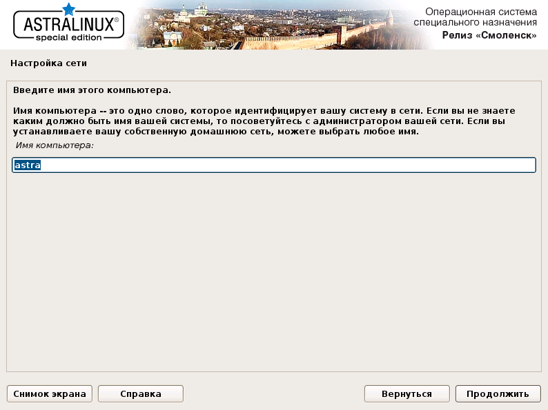

# Установка ОС *ASTRA LINUX SPECIAL EDITION*

1. На экране монитора появится окно, содержащее логотип ОС и меню, в котором необходимо 
выбрать язык установки *Русский* и нажать клавишу **Enter** (рис. 1).
 
   

   Рис. 1 

2. На экране появится предложение о принятии лицензионного соглашения. Необходимо нажать кнопку 
**Продолжить** для дальнейшей инсталляции.

3. Интерфейс меню перейдет на русский язык, после чего необходимо выбрать 
*Графическая установка* и нажать клавишу **Enter** (рис. 2).
 
   

   Рис. 2

4. На экране появится окно *Настройка клавиатуры* (рис. 3), где необходимо выбрать *Alt+Shift* 
или любую другую комбинацию переключения клавиатуры между раскладками и нажать кнопку **Продолжить**.
 
   

   Рис. 3

5. На экране появится окно *Настройка сети* (рис. 4), где необходимо ввести имя компьютера. 
Можно оставить имя "по умолчанию" (или поменять, например, *astra*) и нажать кнопку **Продолжить**.
 
   

   Рис. 4

6. После этого открывается окно *Настройка учетных записей пользователей и паролей* (рис. 5), в котором 
необходимо ввести полное имя нового пользователя, например, *astravdi*, и нажать кнопку **Продолжить**.
 
   

   Рис. 5

7. В следующем окне в строке *Настройка учетных записей и паролей* 
(рис. 6) необходимо ввести имя учетной записи такое же как в предыдущем пункте, например *astravdi*, 
и нажать кнопку **Продолжить**.
 
   

   Рис. 6

8. Затем необходимо дважды ввести пароль *Bazalt1!* для созданного пользователя (рис. 7) и нажать 
кнопку **Продолжить**.
 
   

   Рис. 7

   !!! note "Примечания"
       1. Пароль может включать в себя строчные буквы, цифры и знаки пунктуации.
       2. Длина пароля должна быть не менее восьми символов.
       3. Пароль на экране отображается большими черными точками.
       4. В дальнейшем в процессе эксплуатации в целях безопасности рекомендуется сменить пароль.

9. В следующем окне *Настройка времени* (рис. 8) необходимо выбрать часовой пояс (например, Москва) 
и нажать кнопку **Продолжить**.
 
   

   Рис. 8

10. Далее программа установки ОС начинает разметку дисков. Для этого в появившемся окне 
*Разметка дисков* (рис. 9) необходимо выбрать *Авто – использовать весь диск* и нажать кнопку **Продолжить**.
 
   

   Рис.9

11. В следующем окне *Разметка дисков* (рис. 1.10) необходимо выбрать диск, на который 
будет установлена ОС, и нажать кнопку **Продолжить**.
 
   

   Рис. 10

12. После этого необходимо указать схему разметки *Все файлы в одном разделе (рекомендуется новичкам)* (рис. 11) 
и нажать кнопку **Продолжить**.
 
   

   Рис. 11

13. По окончании разметки необходимо выбрать строку *Закончить разметку и записать изменения на диск* (рис. 12) 
и нажать кнопку **Продолжить**.
 
   

   Рис. 12

14. В следующем окне *Разметка дисков* необходимо выбрать *Да* (рис. 13), чтобы подтвердить необходимость 
записи изменений на диск, и нажать кнопку **Продолжить**.
 
   

   Рис. 13

15. После этого начинается установка базовой системы.

    !!! attention "ВНИМАНИЕ!" 
        В окне *Выбор программного обеспечения* необходимо выбрать *Базовые средства* и 
        *Рабочий стол Fly* и нажать кнопку **Продолжить** (рис. 14).
 
   

   Рис. 14

16. По окончании открывается окно *Выбор и установка программного обеспечения* (рис. 15), в котором 
ничего отмечать не надо, и далее нажать кнопку **Продолжить**.
 
   

   Рис. 15

17. В следующем окне *Дополнительные настройки ОС* (рис. 16) ничего отмечать не надо и далее 
нажать кнопку **Продолжить**.
 
   

   Рис. 16

18. После завершения установки программного обеспечения в открывшемся окне *Установка системного загрузчика* 
(рис. 17) необходимо выбрать *Да* и нажать кнопку **Продолжить**.
 
   

   Рис. 17

19. В открывшемся окне (рис. 18) необходимо ввести пароль для загрузчика GRUB, который надо повторить 
в следующем окне (рис. 19) и нажать кнопку **Продолжить**.
 
   

   Рис. 18

    

   Рис. 19

20. Затем необходимо дождаться появления окна *Завершение установки* (рис. 20), в котором будет 
написано, что установка завершена, и нажать кнопку **Продолжить**. Через некоторое время ВМ перезагрузится.
 
 

Рис. 20
