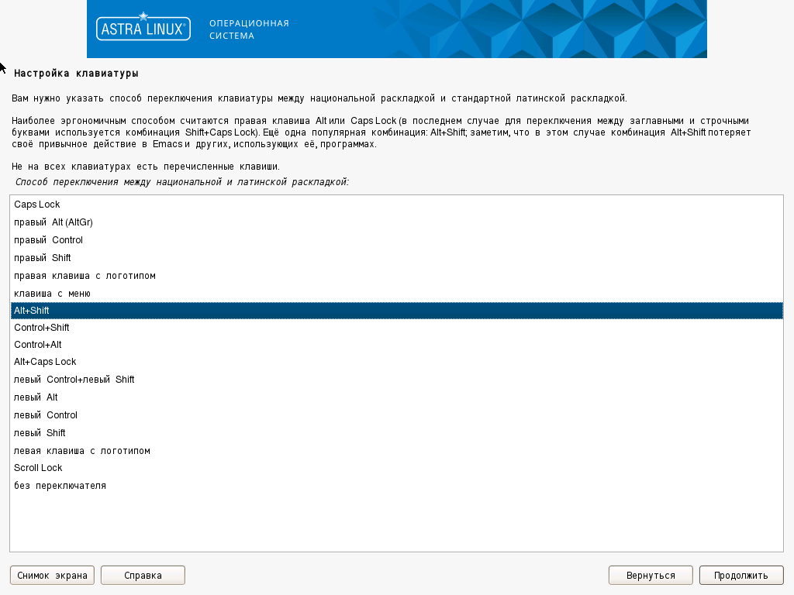

# Установка ОС *ASTRA LINUX SPECIAL EDITION 1.7*

- На экране монитора появится окно, содержащее логотип ОС и меню, в котором необходимо 
выбрать язык установки **Русский** и нажать клавишу **Enter** (рис. 1).
 


Рис. 1

- На экране появится предложение о принятии лицензионного соглашения. Необходимо нажать кнопку 
**Продолжить** для дальнейшей инсталляции.

- Интерфейс меню перейдет на русский язык, после чего необходимо выбрать 
*Графическая установка* и нажать клавишу **Enter** (рис. 2).
 


Рис. 2

- На экране появится окно **Настройка клавиатуры** (рис. 3), где необходимо выбрать *Alt+Shift* 
или любую другую комбинацию переключения клавиатуры между раскладками и нажать кнопку **Продолжить**.
 


Рис. 3

- На экране появится окно **Настройка сети** (рис. 4), где необходимо ввести имя компьютера. 
Можно оставить имя "по умолчанию" (или поменять, например, ```astra```) и нажать кнопку **Продолжить**.
 


Рис. 4

- После этого открывается окно **Настройка учетных записей пользователей и паролей** (рис. 5), в котором 
необходимо ввести полное имя нового пользователя, например, ```astravdi``` (нельзя создавать ```vdiadmin``` - это имя закреплено
за vdi broker), и нажать кнопку **Продолжить**.
 


Рис. 5

- Затем необходимо дважды ввести пароль, например  ```Bazalt1!``` для созданного пользователя в поля **Введите пароль для нового администратора** и **Введите пароль еще раз** (рис. 6) после чего нажать кнопку **Продолжить**.
 


Рис. 6

!!! note "Примечания"
    1. Пароль может включать в себя строчные буквы, цифры и знаки пунктуации.
    2. Длина пароля должна быть не менее восьми символов.
    3. Пароль на экране отображается большими черными точками.
    4. В дальнейшем в процессе эксплуатации в целях безопасности рекомендуется сменить пароль.

- В следующем окне **Настройка времени** (рис. 7) необходимо выбрать часовой пояс (например, **Москва**) 
и нажать кнопку **Продолжить**.
 


Рис. 7

- Далее программа установки ОС начинает разметку дисков. Для этого в появившемся окне 
**Разметка дисков** (рис. 8) необходимо выбрать **Авто – использовать весь диск** и нажать кнопку **Продолжить**.
 


Рис.8

- В следующем окне **Разметка дисков** (рис. 9) необходимо выбрать диск, на который 
будет установлена ОС, и нажать кнопку **Продолжить**.
 


Рис. 9

- После этого в окне **Разметка дисков** необходимо указать схему разметки **Все файлы в одном разделе (рекомендуется новичкам)** (рис. 10) 
и нажать кнопку **Продолжить**.
 


Рис. 10

- По окончании разметки необходимо выбрать строку **Закончить разметку и записать изменения на диск** (рис. 11) 
и нажать кнопку **Продолжить**.
 


Рис. 11

- В следующем окне **Разметка дисков** необходимо выбрать **Да** (рис. 12), чтобы подтвердить необходимость 
записи изменений на диск, и нажать кнопку **Продолжить**.
 


Рис. 12

- Следующим шагом в окне **Выбор программного обеспечения** необходимо выбрать следующее устанавливаемое программное обеспечение (рис. 13):

    * **Графический интерфейс Fly**;
    * **Консольные утилиты**;
    * **Средства фильтрации сетевых пакетов ufw**;
    * **Средства удаленного подключения SSH**.

И нажать кнопку **Продолжить**.


Рис. 13

- Далее откроется окно **Дополнительная настройка ОС** необходимо выбрать уровень защищенности **Максимальный уровень защищенности "Смоленск"** (рис. 14).


Рис. 14

- Далее в окне **Дополнительная настройка ОС** (рис. 15), нужно выбрать только следующие настройки:
    * **Мандатный контроль целостности**;
    * **Мандатное управление доступом**;
    * **Запрет трассировки ptrace**;
    * **Запрос пароля для команды sudo**.

И далее нажать кнопку **Продолжить**.
 


Рис. 15

- После завершения установки программного обеспечения в открывшемся окне **Установка системного загрузчика GRUB на жёсткий диск** 
(рис. 16) необходимо выбрать **Да** и нажать кнопку **Продолжить**.
 


Рис. 16

- В открывшемся окне (рис. 17) необходимо ввести пароль для загрузчика GRUB, например ```Bazalt1!```, который надо повторить 
в следующем окне (рис. 18) и нажать кнопку **Продолжить**.
 


Рис. 17

 

Рис. 18

- Затем необходимо дождаться появления окна **Завершение установки**, в котором будет написано, что установка завершена, и нажать кнопку **Продолжить**, после чего через некоторое время ВМ перезагрузится.