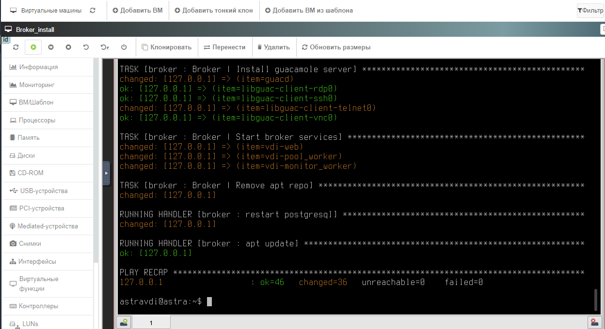
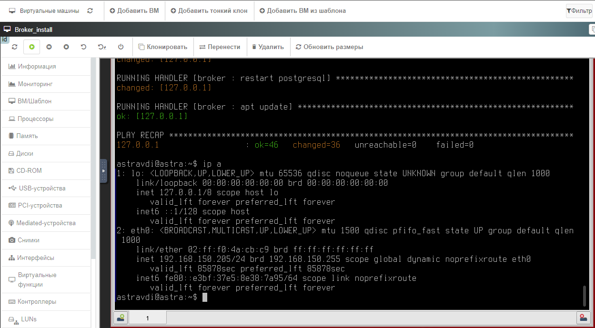
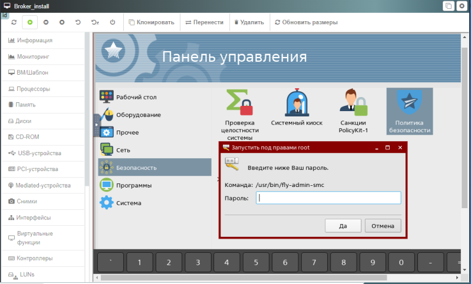
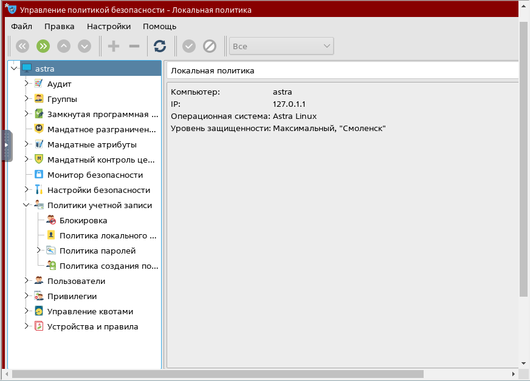
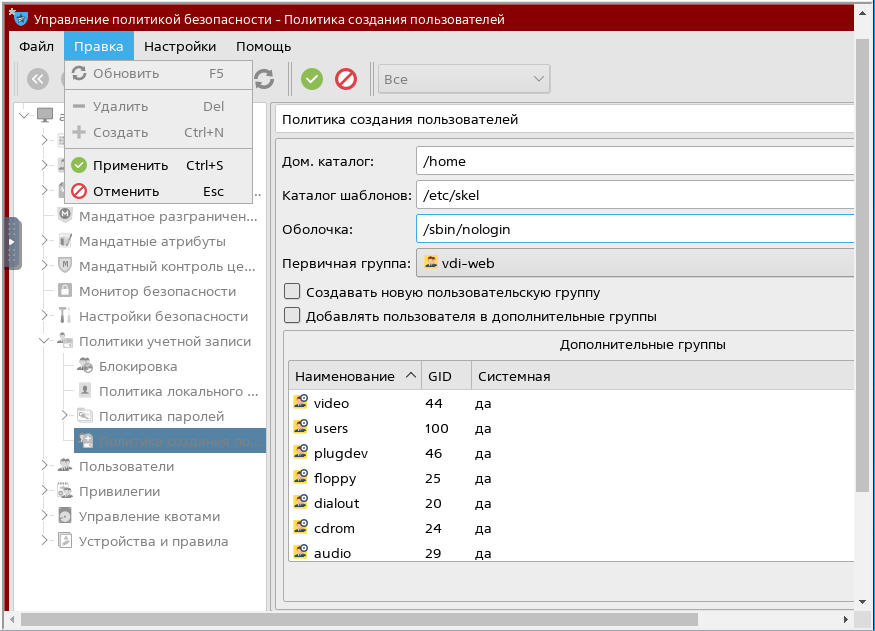
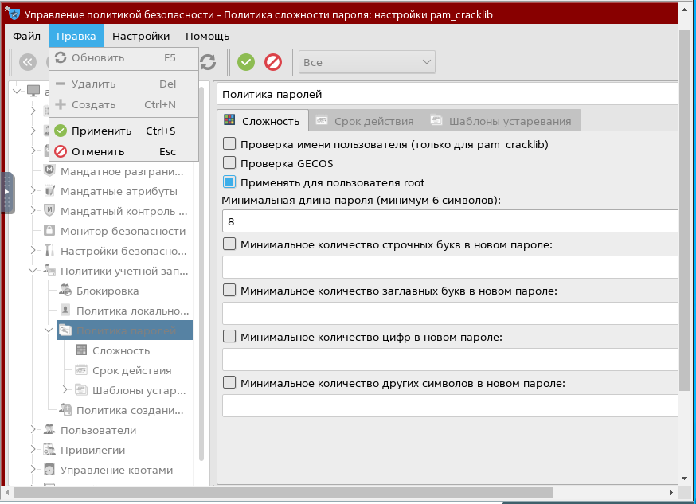
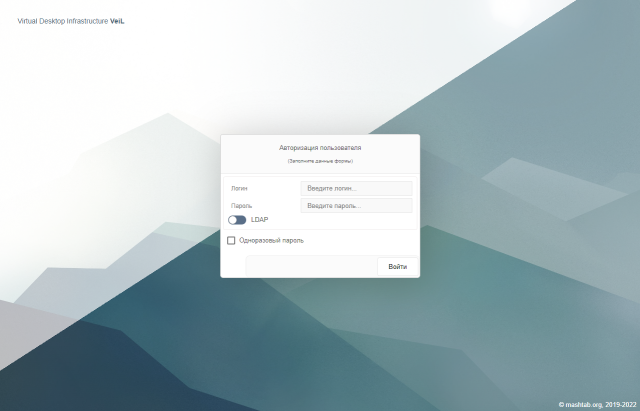
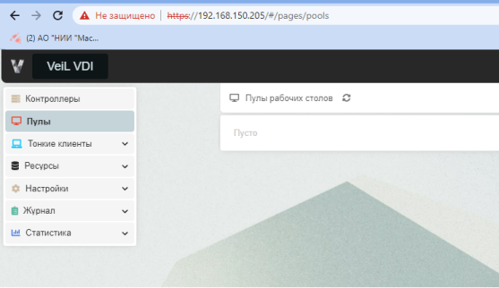

# Установка Veil Broker

## Варианты установки

Выполнить установку **VeiL Broker** на ВМ или физическую машину можно как с физических носителей (DVD-диск или USB-накопитель), 
так и без использования физических носителей, загрузив ISO-образ по протоколу IPMI или с 
помощью сервера сетевых установок в среде **PXE**.

Установка выполняется в автоматическом режиме.

## Порядок установки 

1. Вставить установочный диск **VeiL Broker** в DVD-ROM физической машины или примонтировать ISO-образ **VeiL Broker** в ВМ.

1. Авторизоваться в ВМ. 

1. Перейти в окно приложения для ввода командной строки **Терминал Fly**.

1. Выполнить следующие действия:
   
    `sudo mount /media/cdrom && cd ~`
     
    `sudo bash /media/cdrom/install.sh`
     
    `sudo umount /media/cdrom`  
       
    !!! note "Примечание"
        Монтирование диска через GUI **Astra Linux** может привести к ошибке. Настоятельно рекомендуется монтировать 
        диски через **Терминал Fly**.
   
1. Установка выполняется около 5 мин. 
   
    !!! example "Пример окончания установки"
        

     После установки Web-интерфейс **VeiL Broker** будет доступен по 
     `https://server_ip_address`, где необходимо указать IP-адрес сервера. 
     Список назначенных IP-адресов можно посмотреть в окне приложения **Терминал Fly** с помощью команды `ip a`.
   
    !!! example "Пример выполнения команды `ip a`"
        

## Настройка учетной записи на ВМ 

На ВМ, на которой выполнялась установка **VeiL Broker**, в среде **ECP VeiL** необходимо выполнить следующие действия:

   - перейти во вкладку **Информация** и открыть окно ВМ;

   - авторизоваться, если необходимо;

   - открыть меню **Пуск** и выбрать **Панель управления** → **Безопасность** → **Политика безопасности**

       !!! example "Пример"
           

   - далее ввести пароль **Bazalt1!** для использования прав **root** и нажать **Да**;

   - выбрать **Политики учетной записи** → **Политика создания пользователей**
     
       !!! example "Пример"
           

   -  в поле **Оболочка** указать **/sbin/nologin**, в поле **Первичная группа** указать **vdi-web**. 
     Снять переключатели в **Создавать новую пользовательскую группу** и 
     **Добавлять пользователя в дополнительные группы**. Нажать **Применить настройки** или **Ctrl+S**. 
     
       !!! example "Пример"
              

   - выбрать **Политики учетной записи** → **Политика паролей**. Активировать переключатель 
     **Применять для пользователя root** и нажать **Применить настройки** или **Ctrl+S**.
     
       !!! example "Пример"
           
 

## Вход в VeiL Broker
Этап установки **VeiL Broker** считается завершенным.  Для входа в Web-интерфейс **VeiL Broker** необходимо в строке браузера указать IP-адрес сервера`https://server_ip_address` и 
далее в окне авторизации использовать параметры по умолчанию: пользователь **vdiadmin** / пароль **Bazalt1!**.

   !!! example "Окно авторизации VeiL Broker"
       
   
 
   !!! example "Web-интерфейс VeiL Broker"
       

Далее переходите к работе в соответствии с [Руководством оператора VeiL Broker](../../operator_guide/prepare.md).

