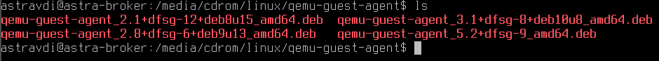

# ОС Astra Linux Special Edition 1.6 релиз Смоленск

## Установка ОС

В среде **ECP VeiL** запустить ВМ, если она не запущена, далее перейти во вкладку **Информация** и открыть окно ВМ.

Запуск программы установки ОС происходит в момент запуска ВМ. Процесс установки **ОС 
Astra Linux Special Edition** версии **1.6** релиз **Смоленск** приведен в [приложении](../../../application1-6.md). 

## Настройка ОС

После завершения установки ОС необходимо войти в систему под именем и паролем, который был 
указан при создании учетной записи, указав значение **Integrity level** равным **63** или уровень целостности 
равным **Высокий** (для графического режима).

### Копирование deb-пакетов установочного диска ОС

1. Открыть приложение для ввода командной строки **Терминал Fly** и выполнить следующие действия:

      - получить привилегии **root** с помощью команды
        
          `sudo su`
     
      - подключить iso-образ **установочного диска ОС**, выполнив последовательно команды:
     
          `mount /media/cdrom`
     
          `mkdir /opt/main`
     
      - осуществить копирование deb-пакетов в систему с помощью команды
        
          `cp -r /media/cdrom/pool /media/cdrom/dists /opt/main/`
        
      - размонтировать диск с помощью команды
        
          `umount /media/cdrom`

1. Вернуться в окно управления **ECP VeiL**, перейти во вкладку **Виртуальная машина** - <имя ВМ> - **CD-ROM**. 
В списке приводов нажать на название привода и в открывшемся окне отключить iso-образ **установочного диска ОС**, нажав кнопку **Извлечь**.
   
### Копирование deb-пакетов диска со средствами разработки ОС

1. Во вкладке **Виртуальная машина** - <имя ВМ> - **CD-ROM**  примонтировать iso-образ 
   [**диска со средствами разработки ОС (devel)**](https://veil-update.mashtab.org/files/astra/smolensk/devel-smolensk-1.6-20.06.2018_15.56.iso), 
   нажав кнопку **Монтировать образ**. В открывшемся окне необходимо выбрать хранилище, где находится iso-образ, и 
   название iso-образа **диска со средствами разработки ОС**. Далее нажать кнопку **Монтировать**.

1. Перейти во вкладку **Информация** и открыть окно ВМ. Авторизоваться, если необходимо.
Перейти в окно приложения для ввода командной строки **Терминал Fly** и 
выполнить следующие действия:

      - если необходимо, получить привилегии **root** с помощью команды
     
          `sudo su`
     
      - подключить iso-образ **диска со средствами разработки ОС**, выполнив последовательно команды:
     
          `mount /media/cdrom`
     
          `mkdir /opt/devel`
     
      - осуществить копирование deb-пакетов в систему с помощью команды
        
          `cp -r /media/cdrom/pool /media/cdrom/dists /opt/devel/`
     
      - размонтировать диск с помощью команды
        
          `umount /media/cdrom`

1. Вернуться в окно управления **ECP VeiL**, перейти во вкладку **Виртуальная машина** - <имя ВМ> - **CD-ROM**.
В списке приводов нажать на название привода и в открывшемся диалоговом окне отключить iso-образ **диска со средствами разработки ОС**, 
нажав кнопку **Извлечь**.

### Настройка репозитория

1. Настроить локальный apt-репозиторий для установки необходимых пакетов, выполнив следующие действия:

      - открыть для редактирования файл **sources.list** с помощью команды
     
          `nano /etc/apt/sources.list`
     
      - привести файл **sources.list** к виду (добавить путь к папке с обновлениями безопасности):
     
          `# deb cdrom:[OS Astra Linux 1.6 smolensk - amd64 DVD ]/ smolensk contrib main non-free`
          
          `deb file:///opt/devel smolensk contrib main non-free`
          
          `deb file:///opt/main smolensk contrib main non-free`
          
      - после редактирования файла нажать **Ctrl+Х** и согласиться с сохранением файла. 

1. Обновить списки пакетов с помощью команды
   `apt-get update`.

## Установка гостевого агента

1. Для корректной работы ВМ на **ECP VeiL** необходимо скачать и выполнить установку последней версии
[**гостевого агента**](https://veil-update.mashtab.org/veil_agent/).

1. Вернуться в окно управления **ECP VeiL**, перейти во вкладку **Виртуальная машина** - <имя ВМ> - **CD-ROM**. 
В списке приводов нажать на название привода и в открывшемся окне нажать кнопку **Монтировать образ**. 
Далее выбрать хранилище, где находится iso-образ, и название iso-образа **veil guest utils**. Далее нажать кнопку **Монтировать**. 

1. Перейти во вкладку **Информация** и открыть окно ВМ. Авторизоваться, если необходимо. 
Открыть приложение для ввода командной строки **Терминал Fly** и подключить iso-образ **veil guest utils** командой
 
     `mount /media/cdrom`

1. Выполнить установку гостевого агента командой  
   `sudo dpkg -i /media/cdrom/linux/qemu-guest-agent/qemu-guest-agent_2.8+dfsg-6+deb9u13_amd64.deb`
   
    !!! example "Пример"
        

1. Перезагрузить ВМ. Если установка прошла успешно, то в разделе **Информация ВМ** появится значение IP-адреса ВМ.
   
    !!! example "Пример"
       
   
1. Вернуться в окно управления **ECP VeiL**, перейти во вкладку **Виртуальная машина** - <имя ВМ> - **CD-ROM**.
В списке приводов нажать на название привода и в открывшемся диалоговом окне отключить iso-образ **veil guest utils**, 
нажав кнопку **Извлечь**.

Этап установки и настройки **ОС Astra Linux** можно считать завершенным. Далее перейти к следующему шагу - 
[Установка VeiL Broker](../../../install/install_broker.md).