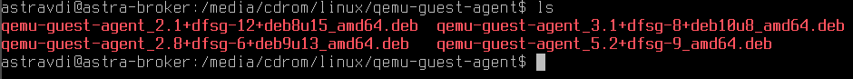
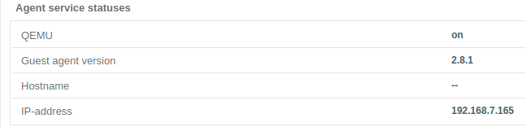

# ОС Astra Linux Special Edition 1.7 релиз Смоленск

## Установка и настройка ОС

Запустить ВМ, если она не запущена, и перейти в появившуюся вкладку **>_Терминал**.

Запуск программы установки ОС происходит в момент запуска ВМ. Процесс установки **ОС Astra Linux Special Edition** версии **1.7** релиз **Смоленск** приведен в [приложении](../application1-7.md). 

После завершения программы установки ОС необходимо войти в систему под именем и паролем, который был 
указан при создании учетной записи, указав значение **Integrity level** равным **_63_** или уровень целостности 
равным **_Высокий_** (для графического режима).

Открыть приложение для ввода командной строки **Терминал Fly** и выполнить следующие действия:

   - получить привилегии **root** с помощью команды
   
     `sudo su`

   - подключить iso-образ установочного диска с ОС выполнив последовательно команды:

     `mount /media/cdrom`

     `mkdir /opt/main`

   - осуществить копирование deb-пакетов в систему с помощью команды
   
     `cp -r /media/cdrom/pool /media/cdrom/dists /opt/main/`
   
   - размонтировать диск с помощью команды
   
     `umount /media/cdrom`

Вернуться в окно управления ECP VeiL и перейти во вкладку **Виртуальная машина** - <имя ВМ> - **CD-ROM**. 
В списке приводов нажать на название привода и в открывшемся диалоговом окне выполнить следующие действия:

   - размонтировать iso-образ установочного диска с ОС, нажав кнопку **Извлечь**;
   - примонтировать iso-образ [диска со средствами разработки (devel)](https://veil-update.mashtab.org/files/astra/smolensk/devel-smolemsk-1.7.0-11.06.2021_12.40.iso), нажав кнопку **Монтировать образ**;
   - откроется окно **Монтирование iso-образа**, в котором необходимо выбрать тип хранилища, его наименование и 
     образ диска со средствами для разработчиков;
   - для сохранения изменений нажать кнопку **Монтировать**.

Выбрать вкладку **>_Терминал**, перейти в окно ВМ и авторизоваться, если необходимо.

После авторизации, перейти в окно приложения для ввода командной строки **Терминал Fly** и 
выполнить следующие действия:

   - если необходимо, получить привилегии **root** с помощью команды

     `sudo su`

   - подключить iso-образ диска со средствами разработки выполнив последовательно команды:

     `mount /media/cdrom`

     `mkdir /opt/devel`

   - осуществить копирование deb-пакетов в систему с помощью команды
   
     `cp -r /media/cdrom/pool /media/cdrom/dists /opt/devel/`

   - размонтировать диск с помощью команды
   
     `umount /media/cdrom`

Настроить локальный apt-репозиторий для установки необходимых пакетов, выполнив следующие действия:

   - открыть для редактирования файл **sources.list** с помощью команды

     `nano /etc/apt/sources.list`

   - привести открывшийся файл к виду (добавить путь к папке с обновлениями безопасности):

    ```
    # deb cdrom:[OS Astra Linux 1.7.0 1.7_x86-64 DVD ]/ 1.7_x86-64 contrib main non-free
    # deb https://download.astralinux.ru/astra/stable/1.7_x86-64/repository/ 1.7_x86-64 main contrib non-free
    deb file:///opt/main 1.7_x86-64 contrib main non-free
    deb file:///opt/devel 1.7_x86-64 contrib main non-free
    ```

   - после редактирования файла нажать **Ctrl+Х** и согласиться с сохранением файла. 

Вернуться в окно управления ECP VeiL и перейти во вкладку **Виртуальная машина** - <имя ВМ> - **CD-ROM**
и размонтировать iso-образ установочного диска с ОС, нажав кнопку **Извлечь**.

Обновить списки пакетов с помощью команды
   `apt-get update`.

## Подготовка ВМ для работы на ECP VeiL

Для корректной работы ВМ на ECP VeiL необходимо скачать и выполнить установку 
[последней версии гостевого агента](https://veil-update.mashtab.org/veil_agent/) на систему.

1. Подключите iso-образ с гостевыми утилитами к ВМ на ECP VeiL:
    
    * перейдите в раздел **Виртуальные машины** и выберите ВМ с установленной ранее **ОС Astra Linux**;
    * в списке приводов нажмите на название привода;  
    * в открывшемся диалоговом окне нажмите кнопку **Монтировать образ** и выберите iso-образ **veil guest utils**.
    

2. Монтируйте iso-образ внутри сеанса ВМ, например 
    ```
    mount /media/cdrom
    ```

3. Выполните установку гостевого агента 
    ```
    sudo dpkg -i /media/cdrom/linux/qemu-guest-agent/qemu-guest-agent_2.8+dfsg-6+deb9u13_amd64.deb
    ```

    !!! example "Пример"
        

4. Перезагрузите ВМ.
Если установка прошла успешно, то в разделе **Информация ВМ** появится значение IP-адреса ВМ.
   
    !!! example "Пример"
        
   
5. Вернитесь в раздел **CD-ROM**,
   чтобы размонтировать iso-образ **veil guest utils** (кнопка **Извлечь**).

Этап установки **ОС Astra Linux** можно считать завершенным. Далее переходите к следующему шагу - 
[Установка VeiL Broker](../../faq/install_v3.md).
