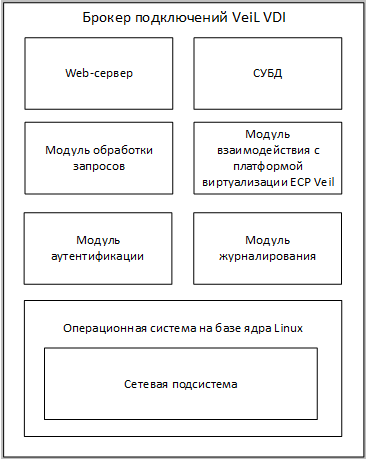

# Структура программы

В программе реализован принцип модульного построения программного обеспечения, 
когда каждый отдельный модуль отвечает за решение узкоспециализированной задачи.

Взаимодействие между модулями организовано на базе прямой адресации объектов в 
пределах одной подсистемы или же с использованием буферизированных средств взаимодействия (файлы, сокеты и сигналы).

Структурная схема VeiL Broker приведена на рис. 1.
 

Рис. 1

Web-сервер – это программный модуль, принимающий HTTP-запросы, приходящие от администратора 
с Web-браузера и от пользователей клиентского ПО VeiL  Connect. Web-сервер перенаправляет 
HTTP-запросы на модуль обработки запросов и отдает статические скомпилированные файлы графического 
Web-интерфейса на АРМ администратора.

Модуль обработки запросов (супервизор) – основной логический компонент VeiL Broker, выполняющий следующие функции:
- прием HTTP-запросов от Web-сервера;
- выборка данных из СУБД;
- формирование динамических данных и их передача на Web-браузер и на VeiL  Connect;
- передача данных для запроса к ECP VeiL по взаимодействию с вычислительными ресурсами через модуль 
  взаимодействия с ECP VeiL;
- прием данных ответов через модуль взаимодействия с ECP VeiL;
- создание и уничтожение ВРС по наступлению различных событий;
- сбор данных о доступных ресурсах на ECP VeiL;
- предоставление клиенту (ПО VeiL  Connect) данных для подключения к ВРС по протоколам SPICE и RDP.

СУБД – выполняет функции хранения служебных данных об инфраструктуре ВРС.

Модуль журналирования – выполняет функции хранения событий, а также их очистки, архивации и выгрузки.

Модуль аутентификации – выполняет функции аутентификации пользователей по локальным учетным 
данным пользователей или по данным, хранящимся на централизованной службе каталогов. 
Выполняет аутентификацию администраторов, пытающихся осуществить попытку входа на Web-интерфейс VeiL Broker 
или пользователей, пытающихся осуществить попытку входа с использованием клиентского ПО VeiL Connect.

Операционная система на базе ядра Linux. В ее среде функционируют все модули VeiL Broker. 
ОС должна иметь возможность установки в качестве гостевой ОС на виртуальные машины ECP VeiL. 
В операционной системе используется сетевая подсистема для обмена сетевым трафиком между 
изделиями VeiL Broker, VeiL Connect, ECP  VeiL по IP-сети.
