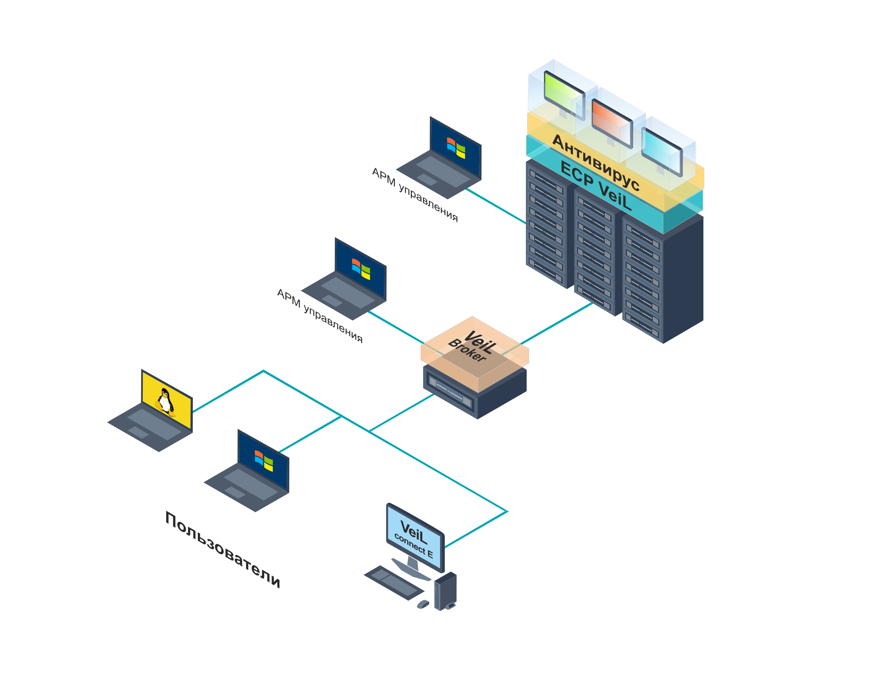
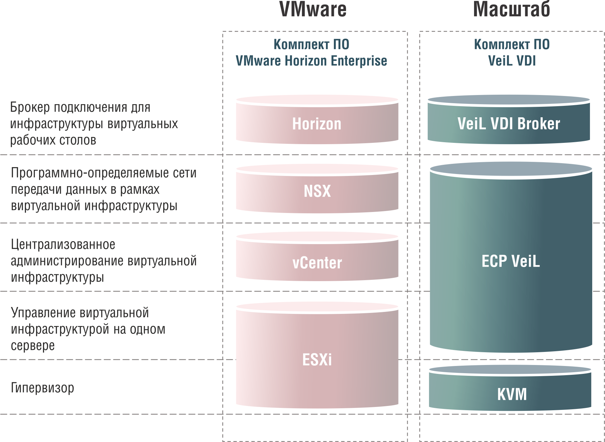

# Компоненты VeiL VDI

Платформа виртуализации рабочих столов **VeiL VDI** является программным продуктом из линейки экосистемы **VeiL**. Общая схема применения представлена на рисунке ниже.

{: style="height:500px"}

В состав **VeiL VDI** входят следующие компоненты:

- платформа виртуализации **ECP VeiL** или **ECP VeiL SE** для **VeiL VDI Special Edition**;
- брокер подключений **VeiL Broker**;
- операционная система **Astra Linux Smolensk**;
- антивирусное средство **Kaspersky Endpoint Security** (для **VeiL VDI Special Edition**) .

### Платформа виртуализации ECP VeiL

Платформа виртуализации **ECP VeiL** для централизованного управления виртуальной инфраструктурой и состоит из серверов виртуализации (Node) с гипервизором **KVM** и сервера управления (Controller).

На физические сервера устанавливается ПО **ECP VeiL** в конфигурации **Node** для запуска виртуальных машин под управлением контроллера.

Контроллер может устанавливаться как на предварительно созданную на сервере виртуализации **ECP VeiL** виртуальную машину, так и на физический сервер. При установке на физический сервер для максимального использования ресурсов можно использовать и как сервер виртуализации. Один контроллер может управлять до 96 серверами виртуализации.

**ECP VeiL** выполняет функции предоставления вычислительных ресурсов и ресурсов хранения данных для виртуальных рабочих столов пользователей. Устанавливается на серверы с процессорной архитектурой x86-64, объединяет их в масштабируемый и отказоустойчивый кластер с возможностью удалённого централизованного управления. 

### Брокер подключений VeiL Broker

Устанавливается на виртуальную машину в среде **ECP VeiL** с предустановленной операционной системой **Astra Linux Smolensk** и установленным антивирусным средством **Kaspersky Endpoint Security** (для **VeiL VDI Special Edition**).

**VeiL Broker** взаимодействует с платформой виртуализации **ECP VeiL**, не только для предоставления доступа к ВРС, но и для автоматизации развертывания и управления ВРС, в том числе заведение ВРС в домен организации. Один **VeiL Broker** поддерживает не более 2000 одновременных подключений к виртуальным рабочим столам.

Управление инфраструтурой осуществляется через графический Web-интерфейс. Также **VeiL Broker** может предоставлять доступ к ВРС через Web-интерфейс пользователя.

### Клиентское программное обеспечение Veil Connect.

Устанавливается на тонкие клиенты, персональные компьютеры и ноутбуки под управлением операционных систем семейств Windows и Linux. 

**Veil Connect** предназначен для удаленного подключения к ВРС посредствам графического интерфейса. Для подключению пользователю необходимо ввести учетные данные и выбрать ВРС для работы, после чего произойдет подключение. **Veil Connect** также позволяет перенаправлять в ВРС различные типы устройств, подключенные к тонкому клиенту, персональные компьютеры или ноутбуку, например накопители, графические планшеты, наушники, видеокамеры и т.д.

### Сопоставление компонентов

Компоненты **VeiL VDI** и их функционал в сравнении с **VMware Horizon Enterprise** представлены на следующей схеме:

