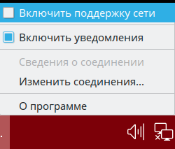
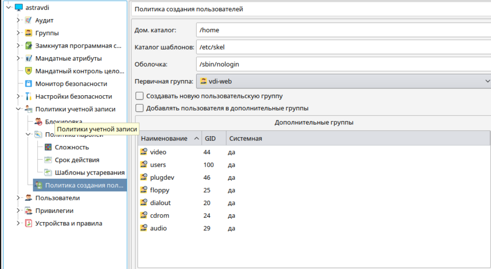
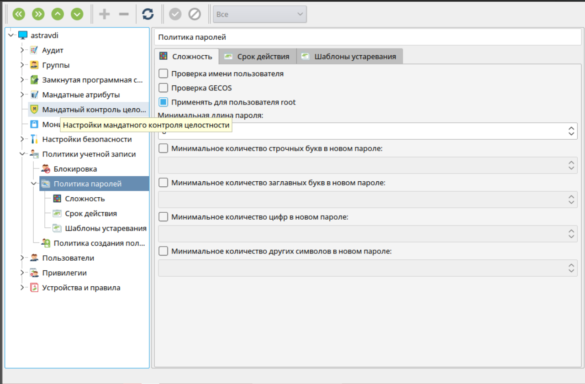

# Установка VeiL Broker 3.0.X

## Подготовка к установке
Описание требований и прочая спецификация доступны в разделах:
[Подготовка сервера](../spec/domain-req.md) и [Перечень портов](../spec/ports_info.md).

## Установка брокера

!!! attention "Внимание"
    Если на момент установки системы на сервере не доступна локальная сеть, **ОБЯЗАТЕЛЬНО** выполните отключение 
    интерфейса, иначе при установке `apache2` возникнет ошибка ломающая дальнейший сценарий установки.
    


1. Подключить iso-образ **VeiL Broker** и выполнить установку с помощью команд:
   
    - с записью результатов в log-файл

    ```bash
    sudo mount /media/cdrom && cd ~
    sudo bash /media/cdrom/install.sh > vdi_install.log
    sudo umount /media/cdrom
    ```
    
     - просто установка
    
    ```bash
    sudo mount /media/cdrom && cd ~
    sudo bash /media/cdrom/install.sh
    sudo umount /media/cdrom
    ```


1. Установка выполняется около 5 мин. После установки Web-интерфейс VeiL Broker будет доступен по 
   https://server_ip_address. По умолчанию пользователь **vdiadmin** и пароль **Bazalt1!**.

1. Войти в **Панель управления** → **Безопасность** → **Политика безопасности** → **Политики учетной записи** и 
   выполнить настройки создания новых пользователей:
   
    - в окне **Политика создания пользователей** в поле **Первичная группа** указать **_vdi-web_**, а в поле **Оболочка** 
     указать **_/sbin/nologin_**. Снять переключатели в **Создавать новую пользовательскую группу** и 
     **Добавлять пользователя в дополнительные группы**
     ;
     
    - войти в **Политики учетной записи** → **Политика паролей** и активировать переключатель 
     **Применять для пользователя root**
     

## Проверка статуса служб системы
Описание служб системы доступно в разделе [Службы системы](./services.md).

## Дополнительная информация

### Отключение механизмов AUTH Astra linux на стороне брокера
В сценарии использования, при котором нет необходимости задействовать **PAM**-аутентификацию, целесообразно деактивировать
данный параметр в приложении. Деактивация существенно увеличит производительность механизма AUTH.

Для этого в файле настроек `/opt/veil-vdi/app/common/local_settings.py` необходимо
заменить стандартные значения ключей `LOCAL_AUTH` и `PAM_AUTH` на: 

```python
LOCAL_AUTH = True
PAM_AUTH = False
```

!!! warning "Предупреждение"
    Параметры являются взаимоисключающими, поэтому редактировать нужно оба.

После установки параметров необходимо перезапустить службы системы либо выполнить полную перезагрузку сервера (службы
 запускаются в автоматическом режиме).

!!! warning "Предупреждение"
    Отключение параметра `PAM_AUTH`, как правило, делает невозможным автоматическое включение его обратно, т.к. между 
    пользователями системы (Astra linux) и брокера появится расхождение.

### Настройка PAM
Описанная ниже информация носит рекомендательный характер. Обратите внимание, что данные настройки могут привести к
полной блокировки доступа в систему.

Pluggable Authentication Modules (PAM, подключаемые модули аутентификации) — это набор разделяемых библиотек, 
которые позволяют интегрировать различные низкоуровневые методы аутентификации в виде единого высокоуровневого API.
При стандартной установке VeiL Broker параметр **PAM_AUTH** включен, что позволяет переложить функции локальной службы
авторизации на ОС Astra Linux, в которой выполнена установка. 

Сам процесс настройки **PAM** в системе не является
параметрами VeiL Broker, однако, за основу можно взять следующий пример:

!!! example "/etc/pam.d/common-auth"
    ```
    # force vdi-web check
    auth required pam_succeed_if.so user ingroup vdi-web
    ```    

!!! example "/etc/pam.d/login"
    ```
    # change default delay
    auth optional pam_faildelay.so delay=1000000
    ```

!!! warning "Предупреждение"
    Не забудьте добавить в указанную группу пользователя, под которым выполняется вход в GUI для администрирования.

Дальнейшее описание работы с системой авторизации доступно [здесь](../auth_v3/info.md).
