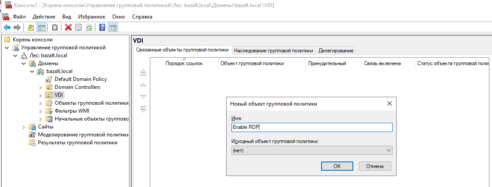
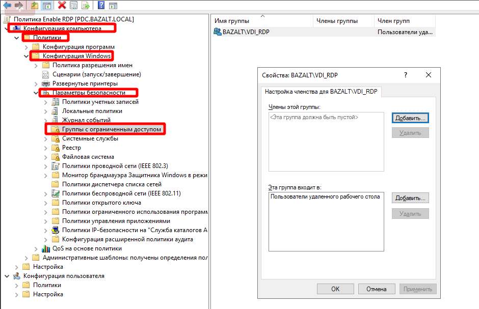
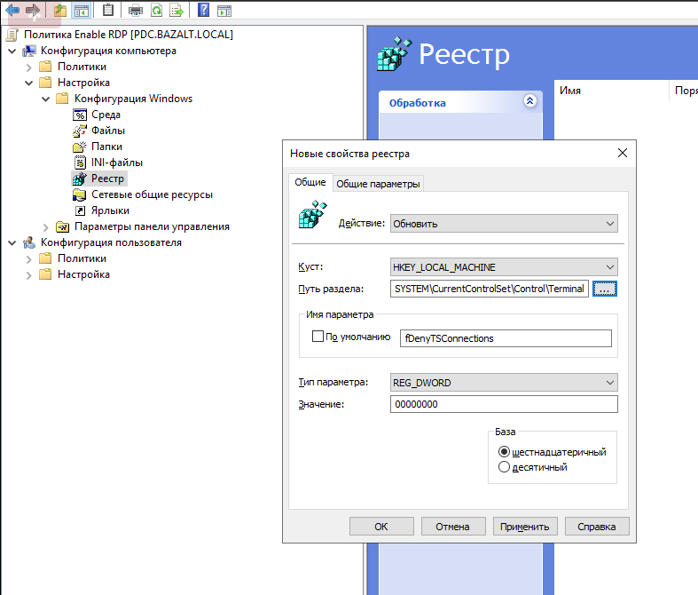

# Настройка GPO через RDP для ВМ в домене MS AD
Для настройки необходимо выполнить 3 шага:
1. Создать группу безопасности
1. Создать групповую политику
1. Проверка применения групповой политики

## Создание группы безопасности
Создадим группу **VDI_RDP** и добавим пользователей, которым будет разрешено входить на ВМ через протокол **RDP**. 
Для это заходим в оснастку **Active Directory — пользователи и компьютеры** → **Имя домена** → **Users**, 
щелкаем по нему правой кнопкой мыши и выбираем из доступных свойств **Создать** → **Группа**, вводим имя группы 
и нажимаем **ОК** 

!!! example "Пример"
    

## Создание групповой политики
Открываем оснастку управления групповыми политиками: 
**Пуск**→ **Средства администрирование Windows** → **Управление групповой политикой**.
Создаём организационный контейнер **VDI**. Контейнер можно создать через оснастку **Управление групповой политикой** либо 
**Active Directory — пользователи и компьютеры**

Политика применяется на организационный контейнер **VDI** в котором располагаются подконтрольные ВМ, поэтому раскрываем домен, 
находим контейнер **VDI**, щелкаем по нему правой кнопкой мыши и выбираем из доступных свойств **Создать объект групповой политики в этом домене и связать его...**.
Назовём его **Enable RDP**. 
Открываем политику на редактирование и переходим в элементы конфигурирования настроек на компьютер:
**Enable RDP** → **Конфигурация компьютера** → **Политики** → **Конфигурация Windows** → **Параметры безопасности** → **Группы с ограниченным доступом**. 
Щелкаем правой кнопкой мыши вызываем свойства и выбираем **Добавить группу** → **Обзор**, далее через **Обзор** 
находим созданную группу: **VDI_RDP**. По окончании нажимаем кнопку **Применить** и **OK**

В окне **Свойства** группы настраиваем членства к другой группе. Нажимаем **Добавить** находим группу 
**Пользователи удалённого рабочего стола** и добавляем. Нажимаем **ОК**.

!!! example "Пример"
    

Теперь активируем галочку разрешить подключение к удалённому рабочему столу в свойства системы ВМ. 
Для этого внесём изменения в групповую политику **Enable RDP**.

**Enable RDP** → **Конфигурация компьютера** → **Настройка** → **Конфигурация Windows** → **Реестр**, создаем новый ключ,
**Создать** – **Элемент реестра**.

!!! example "Значения настроек"
    1. Действие:Обновить
    1. Куст: HKEY_LOCAL_MACHINE
    1. Путь раздела:System\CurrentControlSet\Control\Terminal Server
    1. Имя параметра: fDenyTSConnections
    1. Тип параметра: REG_DWORD
    1. Значение: 00000000

По окончании настроек нажимаем кнопку **Применить** и **OK** для принятия изменений. Теперь чтобы политика применилась на
рабочие станции в организационном контейнере **VDI** они должны быть перезагружены.

!!! example "Пример"
    

## Проверка применения групповой политики
Что бы проверить применилась ли групповая политика **Enable RDP**, необходимо зайти на ВМ в оснастку 
**Управление компьютером** → **Локальные пользователи** → **Группы** → **Пользователи удалённого рабочего стола**.
В свойствах группы должна быть указана группа **VDI_RDP**

!!! example "Пример"
    