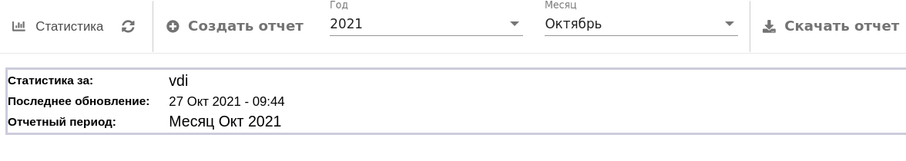

# Веб-статистика

На данной странице представлена информация об активности пользователей VDI брокера, формируемая посредством 
анализа логов веб-сервера Apache. По умолчанию отображаются статистические данные, накопленные за все время работы 
сервиса. Также присутствует возможность создать отчет для конкретного месяца. Для этого необходимо
выбрать год и месяц в выпадающих списках и нажать **Создать отчет**.

Основная представленная информация:

- число уникальных посетителей;
- количество визитов;
- история визитов за месяц, день, часы;
- топ 10 посетителей по домену/стране;
- топ 10 ip посетителей;
- продолжительность визитов;
- топ 10 операционных систем посетителей;
- топ 10 браузеров посетителей.
