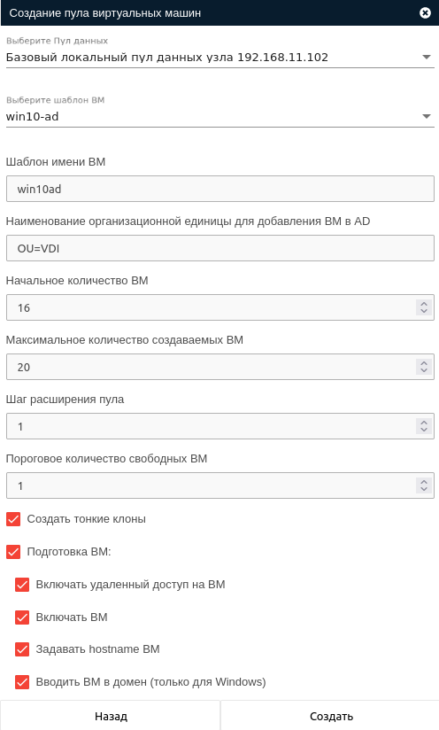

# Автоматический пул (VeiL Broker 3.*)

Работа с автоматическими пулами ВРС, использующих в качестве шаблона настроенные образы MS Windows, позволяет
автоматизировать процесс ввода ВМ в домен и доменные организационные единицы MS AD.

## Процесс подготовки ВМ 
Процесс подготовки ВМ включает в себя следующие шаги:

1. Проверка и включение настройки удаленного доступа на **ECP VeiL**.
1. Задание имени хоста (hostname) по имени ВМ.
1. Заведение ВМ в домен (исключительно для OS Windows) MS AD с использованием powershell из ВМ.
1. Заведение ВМ в организационную единицу (OU) MS AD с использованием LDAP напрямую на контроллере домена.

## Создание автоматического пула с указанием необходимости подготовки ВМ

### Подготовительные шаги
1. Подготовить базовый шаблон ВМ (Windows 10) [veil-guest-utils](../vm/guest_agent.md).
1. Настроить [расширенную интеграцию](../active_directory/ad_extend.md) с MS AD на брокере.

### Создание автоматического пула
Создание автоматического пула производится с помощью кнопки **Добавить пул** в разделе **Пулы** панели администратора.

Ниже приведено описание полей при создании автоматического пула:

1. **Имя пула**  
    Будет использовано как [тег](https://veil.mashtab.org/docs/base/operator_guide/domains/tags) на **ECP VeiL** 
    для всех созданных ВМ.

1. **Типы подключения**  
    Типы подключения к ВМ в пуле, которые будут доступны тонкому клиенту:
    
      - RDP - rdp-подключение средствами ТК (подходит для рабочих мест на основе Linux);
      - NATIVE_RDP - rdp-подключение средствами Windows rdp-клиента (подходит только для рабочих мест на основе Windows);
      - SPICE - подключение будет проксироваться контроллером;
      - SPICE_DIRECT - подключение напрямую в ВМ.

1. **Контроллер**  
    Контроллер **ECP VeiL**, ранее добавленный в систему, на котором будет происходить создание ВМ.
    Контроллер должен быть в активном статусе и отвечать на запросы брокера. Для версии **ECP VeiL 4.5**
    необходимо, чтобы пользователь имел роль **Администратора**.

1. **Пул ресурсов**  
    Предварительно созданный [пул ресурсов](https://veil.mashtab.org/docs/base/operator_guide/resource_pools) 
    на выбранном выше контроллере.

##### Пример формы создания пула ВМ

#### Параметры создания ВМ в пуле

Ниже приведено описание полей при создании ВМ в пуле:

1. **Шаблон ВМ**  
Предварительно созданный [шаблон](https://veil.mashtab.org/docs/base/operator_guide/domains/templates) для 
создания ВМ в пуле.

    !!! info "Шаблон есть на ECP VeiL, но не отображается на брокере"
        При создании автоматического пула брокер отображает только шаблоны с виртуальными дисками.
    
    !!! warning "Шаблон ВМ"
        С шаблоном одновременно может происходить только одно действие. Если Вы планируете создавать сразу
        несколько пулов, то выполняйте создание последовательно. Оптимальным решением для использования одного шаблона
        несколькими брокерами/автоматическими пулами будет для каждого брокера/пула создать отдельный шаблон.

2. **Шаблон имени ВМ**  
Имя шаблона не должно превышать 63 символа и может состоять из букв латинского алфавита, цифр и "-". 
Ограничения вызваны тем, что имя ВМ будет назначено в качестве **hostname** при ее подготовки.

3. **Наименование организационной единицы для добавления ВМ в AD**  
Указание **Организационная единица домена (OU)** для MS AD, в которую необходимо включить созданные ВМ при подготовке.
   
    !!! note "Пример добавления ВМ в AD"
        1. Чтобы добавить ВМ в OU=VDI домена bazalt.local необходимо указать 
          **OU=VDI,dc=bazalt,dc=local**
        2. Чтобы добавить ВМ в OU=VDI внутри ou=vdiou домена bazalt.local необходимо указать 
          **OU=VDI,ou=vdiou,dc=bazalt,dc=local**

    !!! note "Наименование организационной единицы для добавления ВМ в AD"
        Если необходимость включения ВМ в OU отсутствует, оставьте поле пустым, тогда этот шаг будет пропущен.
        ВМ присоединится к организационной единице «Компьютеры», которая используется по умолчанию.

4. **Начальное количество ВМ**  
Количество ВМ, которое будет создано вместе с пулом.

5. **Максимальное количество создаваемых ВМ**  
Максимальное количество ВМ для пула (используется при расширении пула).

6. **Шаг расширения пула**  
Количество ВМ, которое будет создаваться при расширении пула.

7. **Пороговое количество свободных ВМ**  
Значение, при достижении которого будет запущено автоматическое расширение 
(создание новых ВМ из шаблона с шагом выше) пула.

8. **Создать тонкие клоны**  
ВМ, созданные в пуле, будут являться тонкими клонами шаблона. Как результат создание 
будет происходить быстрее, однако ВМ имеют ограничения по используемым дата-пулам. Подробнее можно ознакомиться в разделе 
[Типы пулов данных](https://veil.mashtab.org/docs/base/operator_guide/storage/info).

9. **Подготавливать ВМ**  
Необходимость запуска процедуры подготовки ВМ после их создания. Включение в домен MS AD и организационную единицу (OU) 
для ВМ выполняется только, если ранее была добавлена [служба каталогов](../active_directory/ad_extend.md). **Служба 
каталогов** на **VDI** может не совпадать со службой каталогов на **ECP VeiL**.

!!! warning "Подготавливать ВМ"
    Если на пуле отсутствовал данный параметр в момент создания, то действовать он начнет только после его активации
    и для ВМ, созданных **ПОСЛЕ**.

!!! note "Подготовка ВМ"
    Если в процессе создания пула подготовились не все ВМ или необходимо выполнить подготовку по изменившимся 
    параметрам, то следует нажать кнопку **Подготовить ВМ** в разделе **Информация**. Данная кнопка продолжит 
    подготовку ВМ с последнего успешного действия. 

!!! warning "Удаление ВМ"
    Если пул или ВМ были удалены, то не забудьте вывести ВМ из MS AD.    

##### Пример формы создания ВМ
