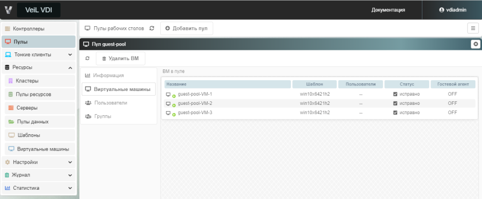

# Изменение размера пула в реальном времени 

## Автоматический и гостевой пул

Для автоматического и гостевого пула имеется возможность расширить пул (увеличить количество ВМ). Для этого необходимо 
в выбранном пуле во вкладке **Информация** выполнить следующие действия: 

1. Указать **Максимальное количество создаваемых ВМ**.

    

2. Указать **Шаг расширения пула**. Шаг увеличения должен быть не больше максимально создаваемых ВМ.

    

3.  Нажать на кнопку **Расширить пул** и в открывшемся окне подтвердить действие, нажав **Выполнить**.

В результате будут созданы ВМ. Результат расширения пула будет виден во вкладке **Виртуальные машины**.

Для гостевого пула необходимо выполнить аналогичные действия, в результате чего будут добавлены новые ВМ.

## Статический и RDS пул

Для статического и RDS пула имеется возможность увеличить или уменьшить количество ВМ в пуле. 

Для добавления ВМ к пулу необходимо в выбранном пуле во вкладке **Виртуальные машины** нажать на кнопку **Добавить ВМ**.
В открывшемся окне выбрать ВМ для добавления в пул и нажать **Выполнить**.

Для добавления ВМ к пулу необходимо в выбранном пуле во вкладке **Виртуальные машины** нажать на кнопку **Добавить ВМ**.
В открывшемся окне выбрать ВМ для добавления в пул, перейти в окно добавления и нажать **Добавить**.

Для удаления ВМ из пула необходимо в выбранном пуле во вкладке **Виртуальные машины** нажать на кнопку **Удалить ВМ**.
В открывшемся окне выбрать ВМ для удаления из пула, перейти в окно удаления и нажать **Удалить**.

