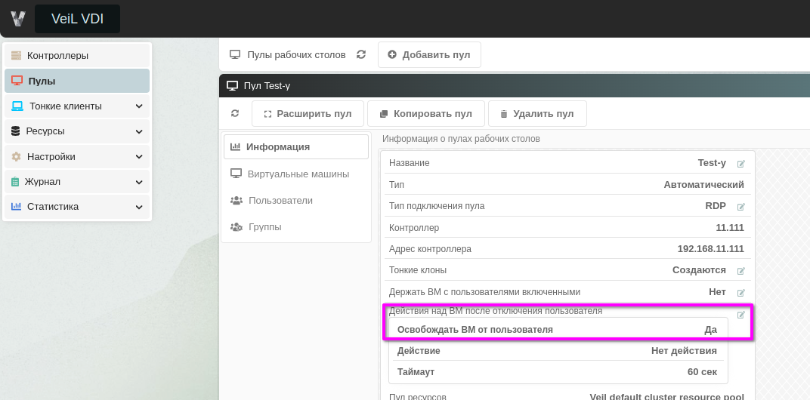
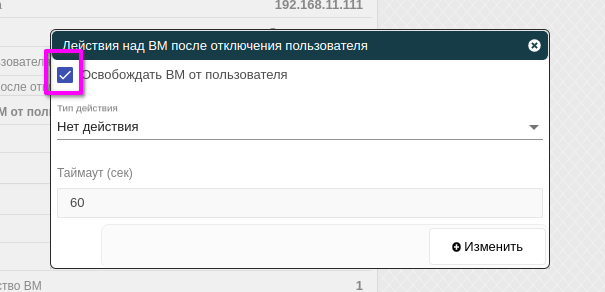

# Функционал "Освобождать ВМ от пользователя"

Для автоматического, статического и гостевого пула имеется возможность освобождать ВМ от пользователя.
Для этого нужно в выбранном пуле перейти во вкладку **Информация**, далее в поле **Действия над ВМ после отключения пользователя** нажать кнопку редактирования.

В открывшемся окне "галочка" в чекбоксе **Освобождать ВМ от пользователя** даст возможность пользователю
при последующем подключении к пулу подключиться к другой ВМ пула.

Также можно выбрать дальнейшее действие над ВМ после отключения пользователя: не делать ничего (****)Выключить,
Выключить форсированно, Пауза, что введёт ВМ в выбранное состояние.