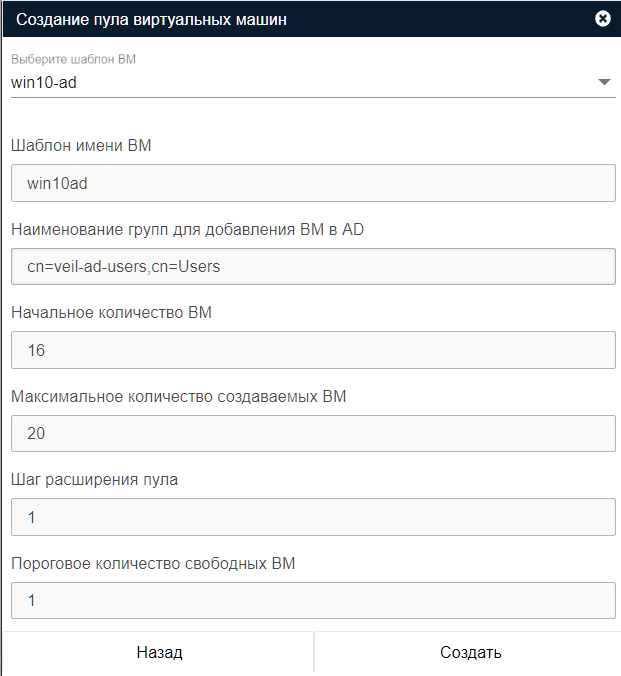

# Гостевой пул

Гостевые пулы предназначены для работы пользователя с "пустой" ВМ. "Пустая" ВМ — тонкий клон шаблона, 
который используется при создании пула. ВМ не сохраняет данные пользователя после окончания работы, 
так как при отключении пользователя удаляется полностью и создается вместо нее новая "пустая" ВМ 
(в журнале задач "Пересоздание ВМ"). 

!!! warning "Удаление ВМ"
        При создании пула указывается время в секундах, по истечению которого, в случае потери связи ВМ с брокером, 
        ВМ удалится. По умолчанию - 60 секунд.

## Создание гостевого пула

### Подготовительные шаги
1. Подготовить базовый шаблон ВМ [veil-guest-utils](../vm/guest_agent.md).

### Создание гостевого пула
Создание гостевого пула производится с помощью кнопки **Добавить пул** в разделе **Пулы** панели администратора.

!!! info "Тонкие клоны"
        При создании гостевого пула все ВМ **ВСЕГДА** будут являться тонкими клонами шаблона. ВМ
        имеют ограничения по используемым дата-пулам. Подробнее можно ознакомиться в разделе 
        [Типы пулов данных](https://veil.mashtab.org/docs/latest/base/operator_guide/storage/info).

!!! info "Подготовка ВМ"
        Также при создании гостевого пула все ВМ **ВСЕГДА** будут подготавливаться после их создания. 

#### Процесс подготовки ВМ
Процесс подготовки ВМ для гостевого пула включает в себя следующие шаги:

1. Проверка и включение настройки удаленного доступа на ECP VeiL.
1. Включение ВМ.

!!! warning "Подготовка ВМ"
    Если в процессе создания пула подготовились не все ВМ или необходимо выполнить подготовку по изменившимся параметрам,
    то следует нажать кнопку **Подготовить ВМ** в разделе **Информация**. Данная кнопка продолжит подготовку ВМ с последнего 
    успешного действия. 

Ниже приведено описание полей при создании гостевого пула:

1. **Имя пула**  
Будет использовано как [тег](https://veil.mashtab.org/docs/latest/base/operator_guide/domains/tags) на ECP VeiL для всех созданных ВМ

1. **Типы подключения**  
    Типы подключения к ВМ в пуле, которые будут доступны тонкому клиенту:
   
    - RDP - rdp-подключение средствами ТК (подходит для рабочих мест на основе Linux);
    - NATIVE_RDP - rdp-подключение средствами Windows rdp-клиента (подходит только для рабочих мест на основе Windows);
    - SPICE - подключение будет проксироваться контроллером;
    - SPICE_DIRECT - подключение напрямую в ВМ;
    - X2GO - предоставляет удаленный доступ к графическому пользовательскому интерфейсу системы Linux.

1. **Контроллер**  
Контроллер **ECP VeiL**, ранее добавленный в систему, на котором будет происходить создание ВМ.
Контроллер должен быть в активном статусе и отвечать на запросы брокера. Для версии **ECP VeiL 4.5** 
необходимо, чтобы пользователь имел роль **Администратор**.

1. **Пул ресурсов**  
Предварительно созданный [пул ресурсов](https://veil.mashtab.org/docs/latest/base/operator_guide/resource_pools) на выбранном выше контроллере.

#### Пример формы создания пула ВМ

### Параметры создания ВМ в пуле

Ниже приведено описание полей при создании ВМ в пуле:

1. **Пул данных**
    Предварительно созданный [пул данных](https://veil.mashtab.org/docs/latest/base/operator_guide/storage/datapools) 
    на выбранном выше контроллере.

2. **Шаблон ВМ**  
Предварительно созданный [шаблон](https://veil.mashtab.org/docs/latest/base/operator_guide/domains/templates) для создания ВМ в пуле.
    
    !!! warning "Шаблон ВМ"
        С шаблоном одновременно может происходить только одно действие, если Вы планируете создавать сразу
        несколько пулов, то выполняйте создание последовательно. Оптимальным решением для использования одного шаблона
        несколькими брокерами/гостевыми пулами будет для каждого брокера/пула создать отдельный шаблон.

3. **Шаблон имени ВМ**  
Имя шаблона не должно превышать 63 символа и может состоять из букв латинского алфавита, цифр и "-". 

4. **Начальное количество ВМ**  
Количество ВМ, которое будет создано вместе с пулом.

5. **Максимальное количество создаваемых ВМ**  
Максимальное количество ВМ для пула (используется при расширении пула).

6. **Шаг расширения пула**  
Количество ВМ, которое будет создаваться при расширении пула.

7. **Пороговое количество свободных ВМ**  
Значение, при достижении которого будет запущено автоматическое расширение (создание новых ВМ из шаблона с шагом выше) пула. 

#### Пример формы создания ВМ в пуле

