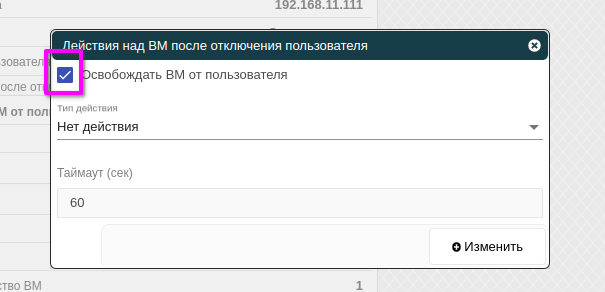

# Действия над ВМ после отключения пользователя

Для автоматического и статического пула имеется возможность освобождать ВМ от пользователя.
Для этого необходимо в выбранном пуле перейти во вкладку **Информация**, далее в поле **Действия над ВМ после отключения пользователя** нажать кнопку редактирования.

Если в открывшемся окне выбрать в чекбоксе **Освобождать ВМ от пользователя**, это дает возможность пользователю при последующем подключении к пулу подключиться к другой ВМ пула.

Также можно выбрать дальнейшее действие над ВМ после отключения пользователя: не делать ничего (**Нет действия**), выключить, выключить форсированно или временно остановить (**Пауза**). Это переведёт ВМ в выбранное состояние.

