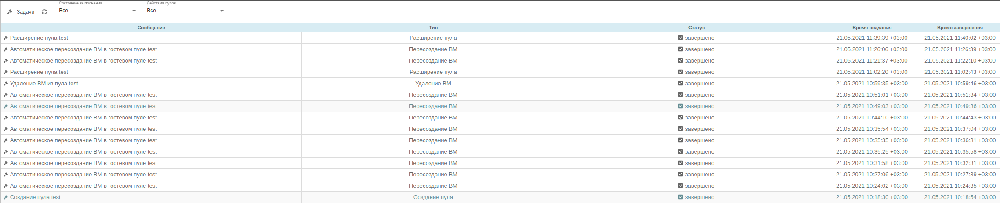
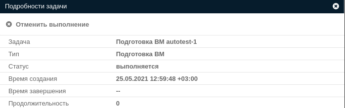
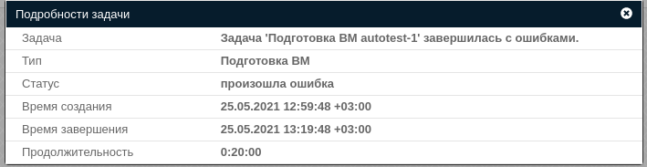
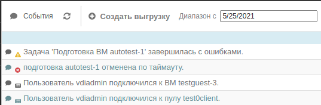

# Фоновые задачи VeiL Broker

## Описание
Под задачей понимается набор групповых действий, выполняемых отдельным процессом брокера `vdi-pool_worker`.
В логику задач вынесены операции, которые могут занимать длительное время.

!!! info ""
    Полный перечень служб отображен в разделе [Службы системы](../faq/services.md).

## Типы задач

   В зависимости от выбранной локализации наименование задачи может отличаться.

| Тип                 | Описание                                              |
|---------------------|-------------------------------------------------------|
| POOL_CREATE         | [Создание пула](tasks.md#_3)                          |
| POOL_EXPAND         | [Расширение пула](tasks.md#_4)                        |
| POOL_DELETE         | [Удаление пула](tasks.md#_5)                          |
| POOL_DECREASE       | [Уменьшение пула](tasks.md#_6)                        |
| VM_PREPARE          | [Подготовка ВМ](tasks.md#_7)                          |
| VMS_BACKUP          | [Создание резервной копии ВМ](tasks.md#_8)            |
| VMS_REMOVE          | [Удаление ВМ](tasks.md#_9)                            |
| VM_GUEST_RECREATION | [Пересоздание ВМ](tasks.md#_10)                       |

### Создание пула
Под созданием пула подразумевается клонирование необходимого количества ВМ (указывается при создании)
из **_золотого образа_**, закрепление этих ВМ за пулом и назначение им тега, соответствующего наименованию пула.
Создание каждой ВМ состоит из нескольких задач на ECP VeiL, успешное выполнение задачи **_создание пула_**
означает успешное выполнение всех подзадач на ECP VeiL. 
Ознакомиться с задачами ECP VeiL можно в 
[руководстве оператора ECP VeiL](https://veil.mashtab.org/docs/latest/base/operator_guide/journal/tasks/). 

### Расширение пула
Расширение пула - это увеличение количество созданных ВМ при достижении порога свободных ВМ. При данном 
типе задачи происходят действия аналогичные **_Созданию пула_** с той разницей, что пул уже должен быть создан.

### Удаление пула
Удаление пула выполняет [удаление созданных ВМ](tasks.md#_9) и закрепленных за ними тегов.

!!! warning "Внимание"
    Обратите внимание, что на данный момент вывод ВМ из AD не происходит. Данные действия необходимо
    выполнить самостоятельно.

### Уменьшение пула
Задача вызывается в случае уменьшения максимального размера пула в панели администратора. Максимальный размер 
невозможно уменьшить ниже текущего количества машин в пуле, так как это потребовало бы удаления существующих машин.

!!! warning "Внимание"
    При попытке уменьшить максимальное количество ВМ ниже количества созданных ВМ
    будет ошибка валидации.

### Подготовка ВМ
Автоматизация шаблонных действий по подготовке новых виртуальных машин пула после создания их из шаблона.
Для любого типа ВМ включает **_разрешение удаленного доступа_** и включение ВМ. Дальнейшие действия связаны
с поддержкой типа ОС ECP VeiL. Более подробные примеры и описание смотрите в разделе 
[Заведение ВРС в Active Directory](../active_directory/ad_vm_prepare.md).

### Создание резервной копии ВМ
Создание резервной копии ВМ вызывает аналогичное действие на ECP VeiL. Подробное описание
смотрите в [документации ECP VeiL](https://veil.mashtab.org/docs/latest/how_to/backup_vm/).

### Удаление ВМ
Задача является комплексной и запускает групповое 
[удаление ВМ](https://veil.mashtab.org/docs/latest/base/operator_guide/domains/remove/) на ECP VeiL.

### Пересоздание ВМ
Под пересозданием понимается удаление и создание новой ВМ из **_золотого образа_**. Основное 
назначение — предоставление уникальной ВМ пользователю.

## Статус выполнения задачи

   В зависимости от выбранной локализации наименование статуса может отличаться.

| Статус      | Наименование | Описание                            |
|-------------|--------------|-------------------------------------|
| INITIAL     | Запускаются  | Задача создана, но еще не запущена  |
| IN_PROGRESS | Выполняются  | Задача выполняется в текущий момент |
| FAILED      | Ошибка       | Задача завершилась с ошибкой        |
| CANCELLED   | Отменено     | Выполнение задачи было отменено     |
| FINISHED    | Завершено    | Задача завершилась успешно          |

## История выполнения задач
В разделе **Журнал -> Задачи** представлен перечень задач, которые выполняются сейчас или были выполнены
ранее.

## Просмотр информации о задаче
Для просмотра расширенной информации о задаче необходимо нажать левой кнопкой мыши на интересующую 
задачу в списке и ознакомиться с описанием.

### Отмена выполнения задачи
Для отмены задачи необходимо нажать левой кнопкой мыши на интересующую задачу в списке
и в появившемся окне нажать кнопку **Отменить выполнение**.

### Информация об ошибке задачи
Если задача выполнена с ошибкой, то для выяснения деталей можно ознакомиться с 
**_Подробностями задачи_**

и **_Подробностями события_** в журнале задач системы.

