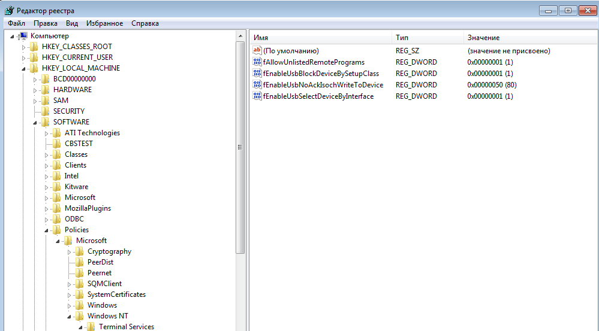

# Запуск в режиме RemoteApp
!!! note "Примечание"
    Только для подключения по RDP.
    

1. На начальной форме авторизации нажмите кнопку **Настройки**.
1. В открывшемся окне выберите вкладку **RDP** и активизируйте пункт **Запустить приложение**.

!!! example "RDP"
    

1. В поле **название** впишите названия приложения (к примеру notepad.exe).
1. В поле **параметры** впишите аргументы командной строки приложения.
1. Нажмите кнопку **Сохранить**.
1. Внутри ВМ необходимо добавить приложение в список разрешенных для запуска, либо разрешить запуск любых приложений, 
задав в регистре "HKEY_LOCAL_MACHINE\SOFTWARE\Policies\Microsoft\Windows NT\Terminal Services" параметр 
fAllowUnlistedRemotePrograms типа dword со значением 1.
1. Перезагрузите ВМ.

!!! example "fAllowUnlistedRemotePrograms"
    
