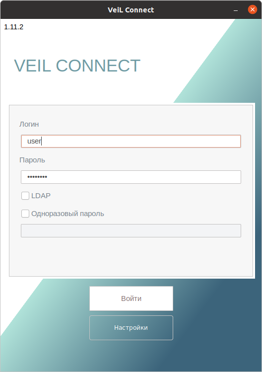

# Окно авторизации пользователя и настройка соединения

!!! example ""
    

В результате запуска программы появляется окно настройки авторизации пользователя, содержащее область ввода 
параметров авторизации, кнопки **Войти** и **Настройки**.

В области ввода параметров авторизации необходимо ввести имя пользователя(**Логин**) и **Пароль**, 
полученные у администратора системы виртуализации или учетные данные пользователя домена. 
Установка маркера в чек-боксе рядом с переключателем **LDAP**(Внешняя служба авторизации) 
сообщает серверу VeiL Broker о том, что учётная запись пользователя хранится в домене 
AD (LDAP). 

В случае если для учетной записи включена двухфакторная аутентификация потребуется ввести
**Одноразовый пароль** [2fa](../../broker/faq/2fa.md).

При выборе **Настройки**->**Основные** открывается окно мастера настройки подключения **VeiL Connect** к серверу 
**VeiL Broker**. В области ввода параметров подключения необходимо задать следующие данные:

- доменное имя или IP-адрес сервера VeiL VDI (вводится в формате *xxx.xxx.xxx.xxx**), 
к которому будет производиться подключение;

- порт сервера VeiL VDI, через который будет производиться подключение (*по умолчанию* 
используется *443*);
  
- установка маркера в чек-боксе рядом с переключателем **Автоподключение к предыдущему пулу** 
приведет к автоматическому подключению к предыдущему выбранному пулу, минуя окно выбора пула.
     
При нажатии на кнопку **Сохранить** происходит сохранение настроек и возврат в 
окно настройки авторизации пользователя.

После ввода параметров авторизации и настройки соединения необходимо нажать кнопку **Войти**.
