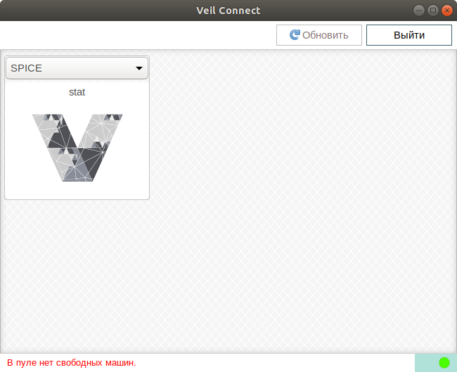

# Возможные ошибки

## Ошибка авторизации

!!! example "RDP"
    
!!! note ""

Решение:

- Проверьте, доступен ли (пингуется) IP-адрес брокера.
- Зайдите в Web-интерфейс брокера и проверьте, существует ли указанный пользователь, активирован ли он и корректен ли 
вводимый пароль.
- Если используется внешняя служба авторизации, проверьте, присутствует ли соответствующая учетная запись 
в домене Active Directory 

## В пуле нет свободных машин

!!! example ""
    
!!! note ""

Решение:

- Если пул динамический, то в Web-интерфейсе брокера увеличьте максимальный размер пула.  
При следующем подключении тонкого клиента пул начнет расширение. Либо запустите расширение вручную, 
нажав на кнопку **Расширить пул**.

- Если пул статический, то добавьте в него ВМ, из существующих на **ECP VeiL**.

## Превышен лимит тонких клиентов

!!! example ""
    

Решение:

- Проверьте наличие лицензии. Зайдите в Web-интерфейс на вкладку **Настройки** -> **Лицензирование**.
- Проверьте количество подключенных тонких клиентов. Их не должно быть больше, чем максимум, указанный в лицензии.

## Не удалось получить ВМ из пула

!!! example ""
    

Данное сообщение указывает на проблемы, связанные с ВМ либо **ECP VeiL**.

Решение:

- Проверьте статус **ECP VeiL**.
- Проверьте статус ВМ в Web-интерфейсе **ECP VeiL**. При обнаружении проблем действуйте в соответствии 
с документацией **ECP VeiL**.

## VeiL Connect аварийно закрывается при попытке пробросить USB устройство (Windows)

Решение:

- Зайдите в **Установка и удаление программ**, удалите UsbDk Runtime Libraries,
удалите VeiL Connect и установите его заново. При установке поставьте галку **установить UsbDk**.

## Ошибка при установке на ubuntu/astralinux: server certificate verification failed. CAfile: /etc/ssl/certs/ca-certificates.crt CRTfile: none

Решение:

####Способ 1

Выполнить:

```
sudo sed -i '/mozilla\/DST_Root_CA_X3.crt/s/^/#/' /etc/ca-certificates.conf
```
```
sudo update-ca-certificates --fresh
```

####Способ 2

Поставить пакет с игнорированием SSL, выполнив:

```
sudo apt-get update -o Acquire::https::veil-update.mashtab.org::Verify-Peer=false
```
```
sudo apt-get -o Acquire::https::veil-update.mashtab.org::Verify-Peer=false install veil-connect
```
