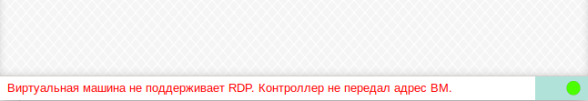

# Возможные ошибки при подключении по RDP

### Виртуальная машина не поддерживает RDP. Контроллер не передал адрес ВМ

!!! example ""
    

Данное сообщение может быть следствием ошибки при подготовке ВМ.

Решение:

- Если ВМ находится в автоматическом пуле, то попробуйте перезапустить подготовку ВМ. Для этого в Web-интерфейсе
найдите соответствующий пул и в нем найдите ВМ, которой владеет пользователь. Выберите эту ВМ и нажмите на кнопку
**Подготовить ВМ**.
- Перезагрузите ВМ.
- Убедитесь, что на ВМ активен гостевой агент (Web-интерфейс **ECP VeiL** -> **Виртуальные машины** -> 
  **Имя текущей машины** -> **Информация** -> **Статусы служб агента**).

### Ошибка ERRCONNECT_LOGON_FAILURE

!!! example ""
    

Данное сообщение будет показано в случае некорректных данных для подключения к ВМ (логин, пароль, домен)

Решение:

- Убедитесь, что учетная запись пользователя на **VeiL Broker** (VDI брокере) совпадает с учетной записью 
  на ВМ (логин/пароль).
- Если ВМ в домене, убедитесь в правильности доменного имени (**Настройки** -> **Основные** -> **Домен**). 
Попробуйте очистить это поле.

### Ошибка ERRCONNECT_AUTHENTICATION_FAILED

Решение:

- Попробуйте выбрать TLS в качестве протокола безопасности (**Настройки** -> **RDP** -> 
**Указать протокол безопасности**). Доступно с версии **VeiL Connect 1.6.7**.

### Ошибка ERRCONNECT_CONNECT_TRANSPORT_FAILED

Данное сообщение может говорить о том, что ВМ выключена или недоступна в сети. При штатной работе **VeiL Broker** (VDI брокера) 
ВМ включается перед выдачей тонкому клиенту.

Решение:

- Подождите 30 секунд и подключитесь повторно.
- В Web-интерфейсе **VeiL Broker** на вкладке **Пулы** -> **Виртуальные машины** выберите соответствующую ВМ 
и нажмите на кнопку **Запуск**.
- Убедитесь, что ВМ доступна в сети.

### Ошибка ERRINFO_DISCONNECTED_BY_OTHER_CONNECTION

Данное сообщение говорит о том, что другой пользователь подключился к текущей ВМ.

### Ошибка Remote application error

!!! example ""
    

Данная ошибка возникает, если выбранное для запуска приложение (**Настройки** -> **RDP** -> 
**Запустить приложение**) не находится в списке разрешенных для запуска.

Решение:

 См. [Запуск в режиме RemoteApp](../settings/rdp_settings.md).
 
### Изображение имеет многочисленные артефакты и искажения
 
 Причинной данной проблемы может быть некорректная работа декодера **h264** на текущей системе.
 
 Решение:
 
 - Откройте **Настройки** -> **RDP**. Попробуйте сменить кодек (AVC420, AVC444). Если это не помогло, то 
 деактивируйте пункт **h264**.
 
### Не удалось добавить TCP USB устройство к виртуальной машине
 
 !!! example ""
    
 
 Данное сообщение будет показано в случае, если **ECP VeiL** не смог добавить TCP USB устройство текущей ВМ.
 
 Решение:
 
 - Убедитесь, что машина, где запущен **VeiL Connect**, соединяется (пингуется) с узла, где находится ВМ.
 - Убедитесь, что на машине, где запущен **VeiL Connect**, открыты на прием TCP соединений порты 17777-17782.
 
 См. [Настройки для возможности перенаправления USB (Spice и RDP)](../operator_guide/vm_window.md).
 
### Не удалось открыть USB устройство. Нет прав? Попробуйте chmod 666 /dev/bus/usb/0xx/0xx
 
 Данное сообщение будет показано при перенаправлении USB, если у **VeiL Connect** нет прав на открытие USB.
 
 Решение:
  
 - Выполните в терминале команду, указанную в подсказке.