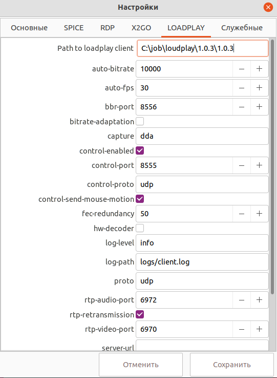

# Настройки Loadplay

Loadplay - протокол удаленного доступа на основе RDP. 
Данный функционал добавлен в версии VeiL Connect 1.12.0 и VeiL брокере версии 4.1.0.

## Подготовка на стороне удаленной машины

- Установите сервер Loadplay.

## Подготовка на стороне тонкого клиента

- Установите клиент Loadplay.

- Перейдите в Настройки VeiL Connect на вкладку LOADPLAY и укажите путь к установленному клиенту.

!!! example "X2Go"
    