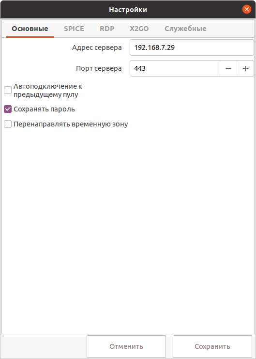

# Основные настройки

!!! example ""
    

1. В поле **Адрес сервера** задается сетевой адрес VeiL Broker.

1. В поле **Порт сервера** задается порт подключения к VeiL Broker (80 - без SSL, 443 - c SSL). 

1. В поле **Домен** задается домен, используемый при подключении по RDP. 

1. При включенной опции **Внешняя служба авторизация** будет использована учетная запись в домене Active Directory.

1. При включенной опции **Автоподключение** приложение подключится к пулу, к которому производились подключение
в последний раз. При отсутствии данных о предыдущем пуле приложение покажет окно выбора пулов.

1. При включенной опции **Сохранить пароль** пароль будет сохранен в файл настроек приложения.