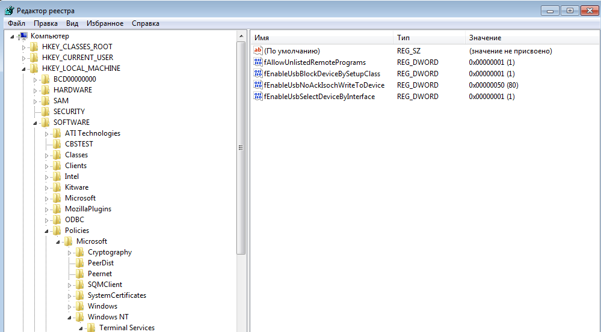

# Настройки RDP


### Описание настроек клиента

!!! example "RDP"
    

1. Формат изображения определяет количество используемых цветов. Рекомендуется BGRA32.

1. Параметр FPS задает частоту обновления экрана. Обновляются только по факту изменившиеся области изображения.

1. Поле **Перенаправляемые папки** предназначено для задания списка папок, которые будут перенаправлены в ВМ. 
Перечислите папки через точку с запятой, либо выберите их с помощью селектора **Добавить папку**.

1. Если указать сетевое подключение, то RDP сервер будет адаптировать параметры подключения в зависимости от выбранного 
режима для достижения оптимального использования сетевого трафика.

1. При включенной опции **Мультимониторность** приложение использует до 3 доступных мониторов. Рекомендуется, чтобы 
на всех мониторах было задано одинаковое разрешение. 

1. При включенной опции **Перенаправлять принтеры** сетевые принтеры будут перенаправлены в ВМ.

1. При включенной опции **Запустить приложение** будет запущено выбранное приложение при подключении.
Смотрите пункт **Запуск в режиме RemoteApp**.

1. При включенной опции **h264** будет использован cтандарт сжатия видео h264, предназначенный для достижения высокой 
степени сжатия видеопотока при сохранении высокого качества. Поддерживаются AVC420 и AVC444 на линуксе 
и AVC420 на Windows. 

1. При нажатии на кнопку **Выбрать USB для перенаправления** откроется диалог  выбора USB устройств, которые
будут перенаправлены. Сервер RDP должен поддерживать технологию RemoteFX.
 
            
### Запуск в режиме RemoteApp

!!! note "Примечание"
    Только для подключения по RDP.
    

1. На начальной форме авторизации нажмите кнопку **Настройки**.
1. В открывшемся окне выберите вкладку **RDP** и активизируйте пункт **Запустить приложение**.
1. В поле **название** впишите названия приложения (к примеру notepad.exe).
1. В поле **параметры** впишите аргументы командной строки приложения.
1. Нажмите кнопку **Сохранить**.
1. Внутри ВМ необходимо добавить приложение в список разрешенных для запуска, а также дать пользователю права на
 использование данного приложения. Либо необходимо разрешить запуск любых приложений, 
задав в регистре "HKEY_LOCAL_MACHINE\SOFTWARE\Policies\Microsoft\Windows NT\Terminal Services" параметр 
fAllowUnlistedRemotePrograms типа dword со значением 1.
1. Перезагрузите ВМ.

!!! example "fAllowUnlistedRemotePrograms"
    
      
           
### Настройки RDP для достижения минимальной полосы пропускания сети

####Действия на сервере Microsoft Server 2008

1. Запустить gpedit.msc.

1. Перейти к пункту "Конфигурация компьютера > Административные шаблоны > Компоненты Windows > Служба удаленных рабочих столов > 
Узел сеансов удаленных рабочих столов > Среда удаленных сенсов".

1. Включить опцию "Наибольшая глубина цвета", выбрать 16 бит.

1. Включить опцию "Настройки RemoteFX".

1. Включить опцию "Оптимизация внешнего вида при использовании RemoteFX".
В параметрах задать: Частота захвата кадров - самая низкая, качество экранного изображения - минимальное.

1. Включить опцию "Задание алгоритма сжатия RDP". Выбрать алгоритм сжатия "Оптимизация использования полосы пропускания сети".

1. Выполнить в терминале и перезапустить сервер:
```
gpupdate /force
```

####Действия на сервере Microsoft Server 2019

1. Запустить gpedit.msc.

1. Перейти к пункту "Конфигурация компьютера > Административные шаблоны > Компоненты Windows > Служба удаленных рабочих столов > 
Узел сеансов удаленных рабочих столов > Среда удаленных сенсов".

1. Включить опцию "Настройки RemoteFX".

1. Включить опцию "Оптимизация визуальных эффектов при использовании RemoteFX".
В параметрах задать: Скорость захвата кадров - самая низкая, качество экранного изображения - самое низкое.

1. Выполнить в терминале и перезапустить сервер:
```
gpupdate /force
```


####Настройках на стороне клиента

1. Отключить декорацию окон.
1. Отключить гладкие шрифты.
1. Отключить Windows темы.