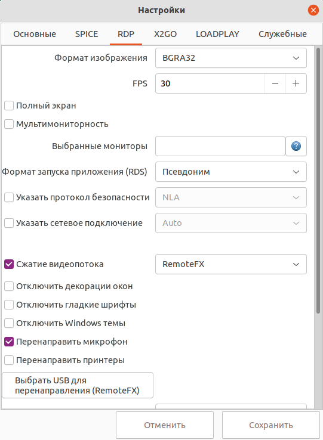

# Настройки RDP


## Описание настроек клиента

!!! example "RDP"
    

1. Формат изображения определяет количество используемых цветов. Рекомендуется **BGRA32**.

2. Параметр **FPS** задает частоту обновления экрана. Обновляются только изменившиеся области изображения.
Параметр влияет на загрузку процессора клиента и не влияет на сетевой трафик.

3. При выборе пункта **Полный экран** приложение раскроется на полный экран.

4. При включенной опции **Мультимониторность** приложение использует до **3** доступных мониторов. Рекомендуется, чтобы 
на всех мониторах была задана одинаковая высота изображения. 

5. **Выбранные мониторы**. Указать, какие клиентские мониторы должны использоваться для отображения 
удаленного рабочего стола. Мониторы должны иметь обшие стороны. Параметр
задается как список id мониторов через запятую. Например: 0,1 - использовать
мониторы с id 0 и 1.  Чтобы узнать идентификаторы(номера) текущих клиентских мониторов нажмите на знак вопроса.
Для использования более одного монитора должна быть активирована опция **Мультимониторность**.

6. **Формат запуска приложения (RDS)** определяет вид строкового идентификатора приложения для запуска на RDS.
 
7. Если указать сетевое подключение, то RDP-сервер будет адаптировать параметры подключения в зависимости от выбранного 
режима для достижения оптимального использования сетевого трафика.

8. При включенной опции **Перенаправлять принтеры** сетевые принтеры будут перенаправлены в ВМ.

9. При включенной опции **Сжатие видеопотока** будет использован указанный cтандарт сжатия видео.
Поддерживаются **AVC420/AVC444/RemoteFX** на Linux и **AVC420/RemoteFX** на Windows.

10. При нажатии на кнопку **Выбрать USB для перенаправления** откроется диалог выбора USB-устройств, которые
будут перенаправлены. Сервер RDP должен поддерживать технологию **RemoteFX USB Redirection**. 
На клиенте у текущего пользователя должны быть права на открытие конкретных USB-устройств.
 
11. Поле **Перенаправляемые папки** предназначено для задания списка папок, которые будут перенаправлены в ВМ. 
Перечислите папки через точку с запятой либо выберите их с помощью селектора **Добавить папку**.
 
12. При включенной опции **Логировать отладочную информацию**, будет сохраняться в файл отладочная информация
при подключении по RDP. Активизация данной опции может замедлить работу приложения. 
            
             
## Настройки RDP для достижения минимальной полосы пропускания сети

####Действия на сервере Microsoft Server 2008, Windows 7

1. Запустить **gpedit.msc**.

1. Перейти к пункту **Конфигурация компьютера > Административные шаблоны > Компоненты Windows > Служба удаленных рабочих столов > 
Узел сеансов удаленных рабочих столов > Среда удаленных сеансов**.

1. Включить опцию **Наибольшая глубина цвета**, выбрать **16 бит**.

1. Включить опцию **Настройки RemoteFX**.

1. Включить опцию **Оптимизация внешнего вида при использовании RemoteFX**.
В параметрах задать: **Частота захвата кадров** - **самая низкая**, **качество экранного изображения** - **минимальное**.

1. Включить опцию **Задание алгоритма сжатия RDP**. Выбрать алгоритм сжатия **Оптимизация использования полосы пропускания сети**.

1. Выполнить в терминале и затем перезапустить сервер:
```
gpupdate /force
```

####Действия на сервере Microsoft Server 2012-2019, Windows 10

1. Запустить **gpedit.msc**.

1. Перейти к пункту **Конфигурация компьютера > Административные шаблоны > Компоненты Windows > Служба удаленных рабочих столов > 
Узел сеансов удаленных рабочих столов > Среда удаленных сеансов**.

1. Включить опцию **Настройки RemoteFX**.

1. Включить опцию **Оптимизация визуальных эффектов при использовании RemoteFX**.
В параметрах задать: **Скорость захвата кадров** - **самая низкая**, **качество экранного изображения** - **самое низкое**.

1. Выполнить в терминале и затем перезапустить сервер:
```
gpupdate /force
```


####Настройки на стороне клиента

1. Выбрать формат изображения **BGRA16**.
1. Отключить декорацию окон.
1. Отключить гладкие шрифты.
1. Отключить Windows темы.
1. При необходимости указать низкоскоростной тип сетевого подключения.


## Включение удаленного доступа на Windows 10

1. Ввести в поиске **SystemPropertiesAdvanced**.
1. В открывшемся окне перейти на вкладку **Удаленный доступ**.
1. Выбрать пункт **Разрешить удаленный доступ**.
1. Если AD не используется, то пользователь, под которым будет производится вход, должен быть добавлен в 
список разрешенных. Перейти к **SystemPropertiesAdvanced->Удаленный доступ**.
Выбрать пользователей и нажать кнопку **Добавить**. Затем ввести имя локального пользователя.

