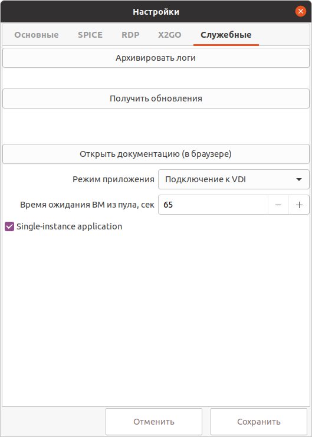

# Служебные настройки

!!! example ""
    
    
1. При нажатии на кнопку **Архивировать логи** будет создан архив с логами приложения (**log.tar.gz**) и показан 
путь-расположение архива. Реализовано для ОС Windows 10 и Linux.

1. При нажатии на кнопку **Получить обновления** будет запущен сценарий обновления приложения.

1. При нажатии на кнопку **Открыть документацию** будет открыта документация в браузере по умолчанию.

1. При активизации **Подключение к удаленной машине напрямую** приложение будет работать в режиме прямого подключения 
к удаленной машине, минуя VDI брокер.

1. **Время ожидание ВМ из пула** - это максимальное время(таймаут), в течение которого будет ожидаться ВМ. 
По завершению таймаута запрос ВМ завершится с ошибкой.