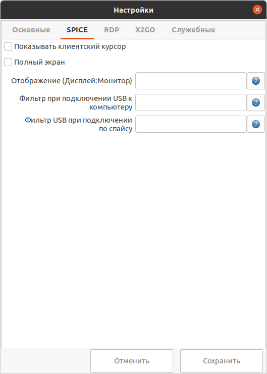

# Настройки Spice

!!! example "Spice"
    
    
1. При включенной опции **Показывать клиентский курсор** клиентский курсор "мыши" не будет скрыт.

1. При выборе пункта **Полный экран** приложение раскроется на полный экран.

1. Список пар отображений гостевых дисплеев на клиентские мониторы (через точку с запятой). 
Например, чтобы отобразить гостевые дисплеи 0 и 1 на клиентские мониторы 0 и 1,
используйте 0:0;1:1. Список должен содержать id всех дисплеев от 0 до
последнего желаемого, т. е. 2:2 это невалидный параметр, так как отсутствуют
отображения для дисплеев 0 и 1. Данный параметр имеет эффект только в режиме
ПОЛНОГО ЭКРАНА. Требуется ПЕРЕЗАПУСК приложения, чтобы применить изменения.
Количество дисплеев ВМ задается в веб-интерфейсе ECP VeiL. Чтобы узнать идентификаторы(номера)
текущих клиентских мониторов нажмите на знак вопроса.

1. Строка фильтр, используемая для задания какие USB устройства должны быть 
автоматом проброшены при их (физическом) подключении к компьютеру-тонкому клиенту и 
при успешной установке подключения по Spice.