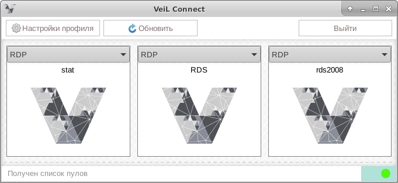
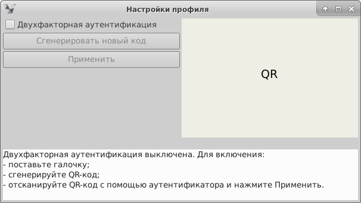
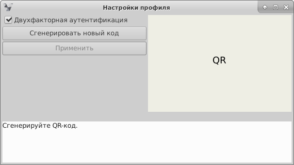
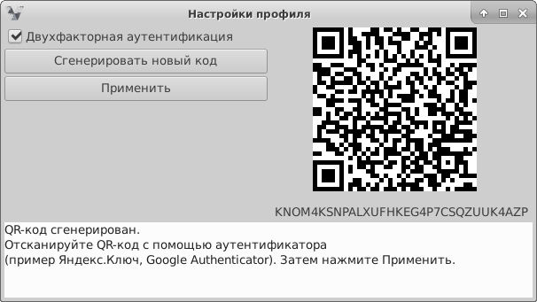
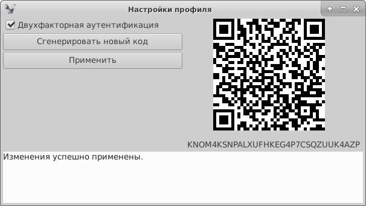

# Настройка двухфакторной аутентификации

!!! note "Примечание"
    Доступно, начиная с версии **VeiL Connect 1.7.0** и версии **VeiL Broker 3.1.1.**.   
    При включении двухфакторной аутентификации при каждой авторизации будет требоваться
    одноразовый пароль, генерируемый приложением-аутентификатором (система тестировалась с приложениями: Яндекс.Ключ, 
    Google Authenticator).

### Включение

1. Авторизируйтесь в **VeiL Connect**, введя имя пользователя/пароль и нажав **Войти**.

1. После успешной авторизации нажмите кнопку **Настройки профиля**.

   

1. В открывшемся окне активируйте пункт **Двухфакторная аутентификация**.

   

1. Нажмите кнопку **Сгенерировать новый код**.

   

1. Отсканируйте QR-код c помощью аутентификатора (система тестировалась с приложениями: Яндекс.Ключ, Google Authenticator).

   

1. Нажмите **Применить**.

   
    
    
### Отключение

1. Зайдите в **Настройки профиля** и деактивируйте пункт **Двухфакторная аутентификация**.

1. Нажмите **Применить**.