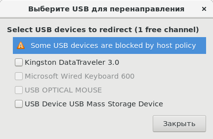
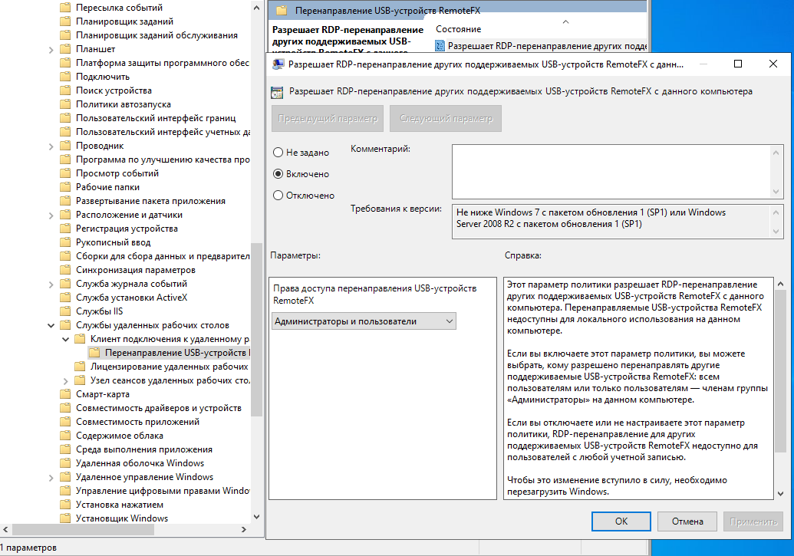
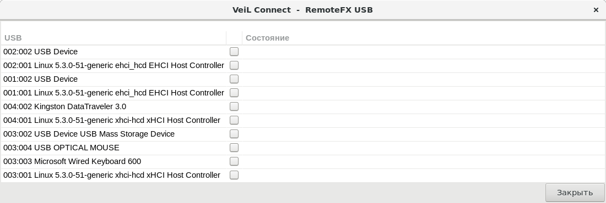
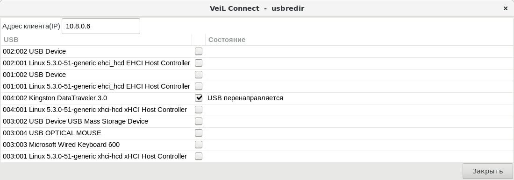

# Перенаправление USB (Spice и RDP)

## Общие требования

- Текущий пользователь должен иметь право на перенаправление USB (Задается администратором в Web-интерфейсе 
[Разрешения](../../broker/auth_v3/client-permissions.md)).

- Если **VeiL Connect** запущен на Linux, то пользователь должен иметь разрешение на открытие USB 
(Выполнить chmod 666 для устройства / добавить пользователя в группу, владеющую устройством / изменить 
разрешения устройства).

- Если **VeiL Connect** запущен на машине с ОС Windows, то там необходимо установить
[UsbDk](https://github.com/daynix/UsbDk/releases/download/v1.00-22/UsbDk_1.0.22_x64.msi).

- В Web-интерфейсе **ECP VeiL** у ВМ должен быть добавлен USB-контроллер **nec-xhci** (USB3.0) (**Настройки** - **Контроллер**).

- Если удаленная машина работает под управлением ОС Windows 7 или Windows Server 2008, то для корректной работы на этих 
машинах должен быть установлен драйвер 
[NEC USB 3.0 Driver](https://support.lenovo.com/ru/en/downloads/ds018533).

## Spice

- В Web-интерфейсе **ECP VeiL** у ВМ должен быть добавлен USB Spice канал 
(**USB-устройства** -> **Подключить**).

- После запуска **VeiL Connect** и подключения по протоколу Spice выберите в меню пункт **Проброс USB**.

- В открывшемся окне выберите USB устройство для перенаправления.

!!! example ""
    

## RDP

При подключении по RDP USB устройство можно пробросить двумя способами: с помощью технологии **RemoteFX USB** и
по протоколу **usbredir**.

#### RemoteFX USB

!!! note "Примечание"
    Перенаправление flash накопителей не поддерживается: используйте перенаправление папок.
    
- Виртуальная машина долна быть размещена  на хосте с поддержкой **RemoteFX**  (Windows 7 SP1 и новее) 

- Если **VeiL Connect** запущен на машине с ОС Windows, то должна быть включена опция **Разрешить перенаправление 
других поддерживаемых USB устройств RemoteFX c данного компьютера**. Для этого введите **gpedit** в терминале.
В открывшемся окне перейдите по пути Конфигурая компьютера - Административные шаблоны - Компоненты Windows -
Службы удаленных рабочих столов - Клиент подключения к удленному рабочему столу - 
Перенаправление USB-устройств RemoteFX. Кликните 2 раза на пункт **Разрешить перенаправление...**. 
Это откроет окно, в котором выберите пункт **Включено** и параметр **Администраторы и пользователи**.
Нажмите **Применить** и перезагрузите компьютер.

!!! example ""
    
    
- После запуска **VeiL Connect** перейдитите в **Настройки** -> **RDP** и нажмите на кнопку
**Выбрать USB для перенаправления**.

- В открывшемся окне выберите необходимое USB устройство и нажмите **Закрыть** -> **Сохранить**.

!!! example ""
    

#### usbredir

!!! note "Примечание"
    В текущнй реализации клиент выступает сервером, транслирующим данные USB на удаленную машину. 

- Для перенаправления USB по протоколу **usbredir** необходимо, чтобы машина, где запущен  **VeiL Connect** (ТК), 
и сервер, где находится ВМ, были взаимодоступны в сети (т.е. чтобы с сервера проходило соединение (пинг) 
  до машины ТК). 
  
- Необходимо, чтобы на машине, где запущен **VeiL Connect**, были открыты на прием TCP 
  соединений порты 17777-17782.

- После запуска **VeiL Connect** и подключения по протоколу RDP выберите в меню пункт **Проброс USB**.

- Если автоматическое определение адреса клиента не удалось, то введите его вручную. 
Адрес клиента должен быть доступен для подключения с удаленной машины.

- В открывшемся окне выберите USB устройство для перенаправления.

!!! example ""
    