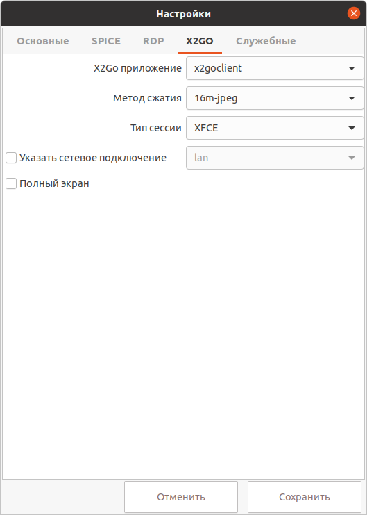

# Настройки X2Go

## Подготовка на стороне удаленной машины

- На удаленной машине должна быть установлена операционная система семейства Linux.

- Установите X2Go сервер, следуя инструкции [X2Go Server installation](https://wiki.x2go.org/doku.php/doc:installation:x2goserver).

- Установите одну из поддерживаемых сред рабочего стола. **Рекомендуемые:  XFCE, LXDE (не LXQt), MATE**.
Подробности по ссылке [X2Go Desktop Environment Compatibility](https://wiki.x2go.org/doku.php/doc:de-compat).

## Подготовка на стороне тонкого клиента

- Установите клиент X2Go на выбор: [x2goclient](https://wiki.x2go.org/doku.php/doc:installation:x2goclient) либо 
[pyhoca-cli](https://wiki.x2go.org/doku.php/doc:installation:pyhoca-cli). 

- Запустите VeiL Connect, откройте **Настройки** -> **X2GO** и выберите установленное приложение-клиент для запуска.

!!! example "X2Go"
    

- Выберите метод сжатия изображения (по умолчанию 16m-jpeg).

- Укажите **Тип сессии** (среду рабочего стола, поддерживаемую удаленной машиной).

- При выборе пункта **Полный экран** приложение раскроется на полный экран.

- Нажмите **Сохранить**.

- При подключении к ВМ будет запущен выбранный X2Go клиент. 

- При выборе **x2goclient** откроется графическая форма следующего вида(см. картинку), в которой необходимо вввести пароль от
учетной записи на ВМ. В качестве логина по умолчанию будет использовано имя, указанное при авторизации в VeiL 
Connect. По желанию можно нажать **Отмена** и ввести иные учетные данные.

!!! example "X2Go"
    
        
- При выборе **pyhoca-cli** откроется графическая форма следующего вида(см. картинку). В качестве логина и пароля 
по умолчанию будут использованы учетные данные указанные при авторизации в VeiL Connect. По желанию можно нажать 
**Прервать** и ввести иные учетные данные, затем нажать **Подключиться**.

!!! example "X2Go"
    
    
- При удачном подключении откроется окно с удаленным рабочим столом. Для завершения сессии рекомендуется делать
 выход из системы (Log Out).