# Установка ОС *АЛЬТ РАБОЧАЯ СТАНЦИЯ*

Установка ОС **Альт  Рабочая станция** версии **9.1** происходит в следующей последовательности:

- подготовить USB flash-накопитель;
- скопировать на USB flash-накопитель образ ОС;
- выполнить восстановление ОС из образа на устройстве;
- первый запуск ОС.

1. Для установки ОС **Альт  Рабочая станция** версии **9.1** необходим USB flash-накопитель 
объёмом не менее 2 Гбайт с файловой системой FAT.

2.  Для копирования образа ОС **Альт Рабочая станция** версии **9.1** на USB flash-накопитель 
необходимо выполнить следующие действия:

    - загрузить с сайта разработчика образ ОС. 

        !!! note "Примечание"
            Получить ISO-образ **Debian** можно через Интернет с официального сайта: 
            http://nightly.altlinux.org/p9-mipsel/release/, выбрав любой образ 
            начинающийся со слова **tavolga**.

    - перед копированием необходимо переименовать скаченный образ в **recovery.tar**;

    - скопировать скаченный образ **recovery.tar** в корень файловой системы 
        USB flash-накопителя.

3. Восстановление ОС **Альт Рабочая станция** версии **9.1** из образа происходит 
в следующей последовательности:

    - нажать кнопку включения на терминале **Таволга 2ВТ1** и удерживать её не менее 10 секунд;

    - после окончания загрузки терминала в верхней части экрана появится окно (рис. 1) 
        с надписью **T-Platforms mITX recovery** и строка меню. В нижней части окна 
        расположена краткая инструкция по функциям клавиш;

      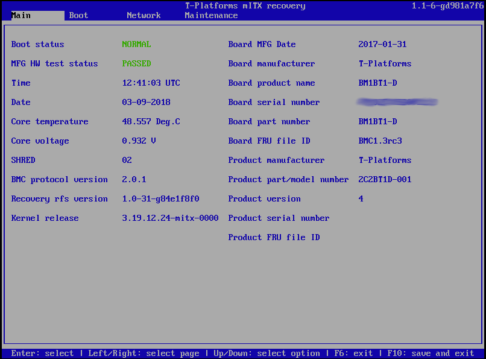
 
      Рис. 1

    - выбрать пункт меню **Maintenance**;

    - появится надпись **Recovery options** (рис. 2), под которой расположено 
        вертикальное меню из 2-х пунктов. Верхний пункт меню отвечает за перепрошивку 
        с USB flash-накопителя. Нижний пункт меню отвечает за перепрошивку из 
        файла **recovery.tar**, хранящегося на встроенном SSD или подключенном диске. 
        Выбор меню осуществляется с помощью курсора и клавиши **Enter**;

        !!! note "Примечание"
            Если flash-накопитель не вставлен или в корне вставленного 
            flash-накопителя отсутствует корректный файл **recovery.tar** с образом, 
            на верхнем пункте меню будет надпись **USB recovery image not found**.

      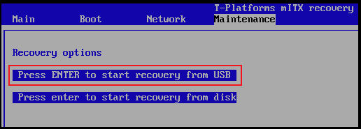

      Рис. 2

    - вставить flash-накопитель с корректным образом **recovery.tar** в USB-порт 
       на терминале **Таволга 2ВТ1**. Надпись на верхнем пункте меню изменится на 
       **Press Enter to start recovery from USB** (см. рис. 2). Убедиться, что курсор 
       указывает на этот пункт и нажать клавишу **Enter**;

    - появится меню выбора целевого диска (рис. 3), на который будет записана ОС. 
       Встроенный SSD Таволги будет записан как **/dev/sda**. Необходимо убедиться, 
       что курсор указывает на этот пункт и нажать клавишу **Enter**;
 
      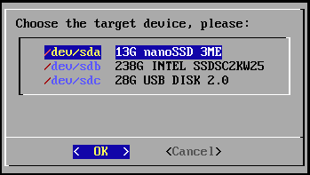

      Рис. 3

    - подтвердить запись данных на выбранный диск введя **YES** в поле и нажмите 
       клавишу **ENTER**;

    - начнется процесс восстановления, по окончании которого появится окно (рис.4) 
       с надписью **Press ENTER to continue**. Необходимо нажать клавишу **Enter**;

      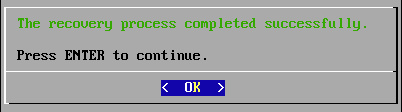

      Рис. 4

    - после завершения прошивки появится окно с надписью **T-Platforms mITX recovery** 
        и строка меню (см. рис. 1);

    - для загрузки терминала со встроенного диска необходимо перейти в 
        пункт меню **Boot** (рис. 5) и в качестве **Boot partition** выбрать параметр **sata0:0**;
 
      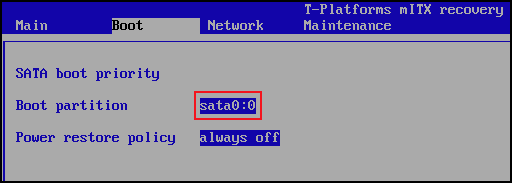

      Рис. 5

    - перезагрузить терминал **Таволга 2ВТ1**, нажав клавишу **F10**.

4. При первом запуске с новой прошивки будет предложено пройти стандартную процедуру 
  установки и настройки в соответствии со следующими пунктами:

    - после запуска программы установки необходимо с помощью клавиш перемещения курсора **↑**, **↓** 
      выбрать пункт меню **Установка** и нажать **Enter**;

        !!! note "Примечание"
            В начальном загрузчике установлено небольшое время ожидания: 
            если в этот момент не предпринимать никаких действий, то будет загружена та 
            система, которая уже установлена на жестком диске. Если нужный момент выбора 
            пункта меню пропущен, перезагрузите компьютер и вовремя выберите пункт **Установка**.

    - на экране появится окно **Язык** (рис. 6), в котором необходимо выбрать 
      язык установки интерфейса программы установки и устанавливаемой системы, 
      например, **Русский** и вариант переключения раскладки клавиатуры, например, 
      клавиши **Control** и **Shift** одновременно. После завершения выбора нажать кнопку **Далее**;

      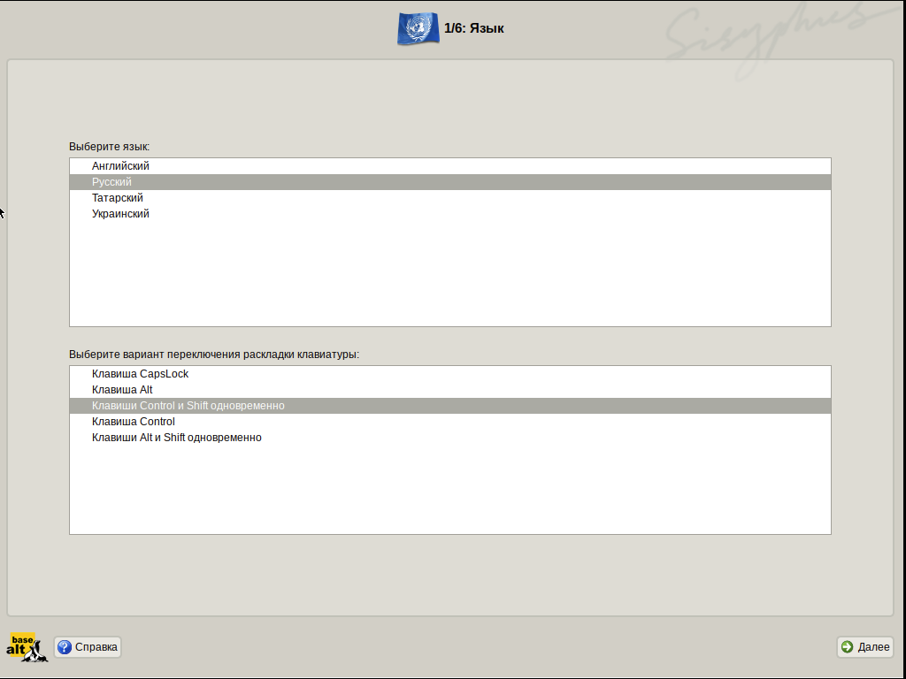

      Рис. 6

    - на экране появится окно **Лицензионный договор** с лицензионным соглашением (рис. 7). 
      После ознакомления с лицензией необходимо установить флаг в поле **Да, я согласен 
      с условиями** и нажать кнопку **Далее**;
  
      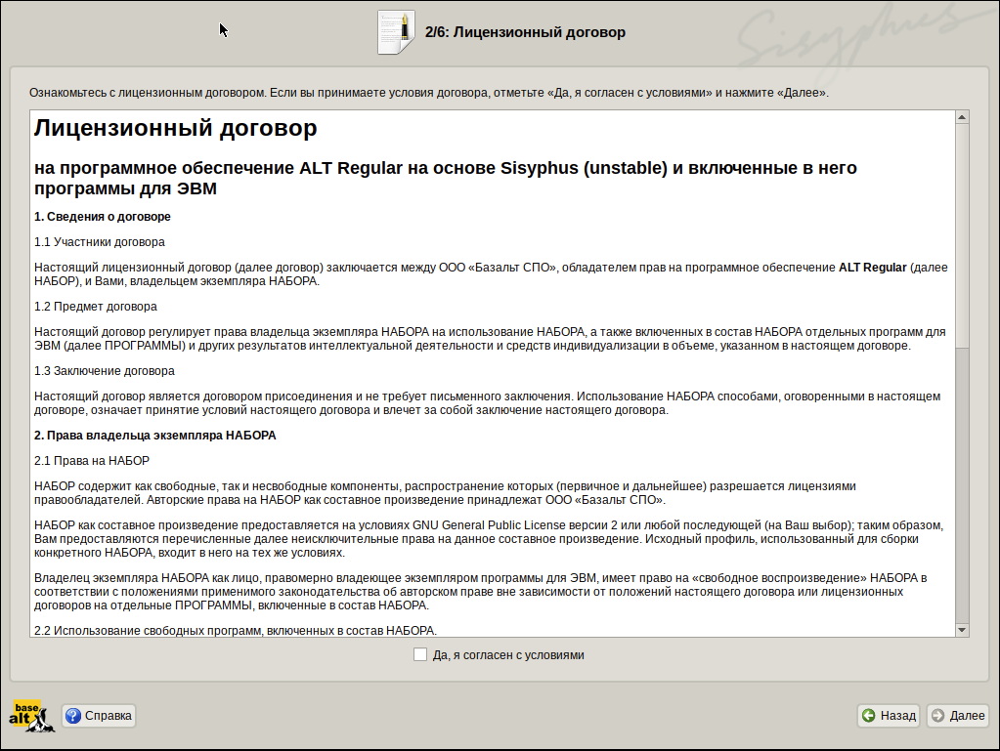

      Рис. 7

    - в появившемся окне **Дата и время** (рис. 8) в поле **Выберите страну:** из 
      выпадающего списка выбрать страну **Россия** и установить часовой пояс **Москва**. 
      После завершения выбора нажать кнопку **Далее**;

        !!! note "Примечание"
            Наличие флага в поле **Хранить время в BIOS по Гринвичу** 
            выставляет настройки даты и времени в соответствии с часовыми поясами, 
            установленными по Гринвичу, и добавляет к местному времени часовую поправку 
            для выбранного региона.

      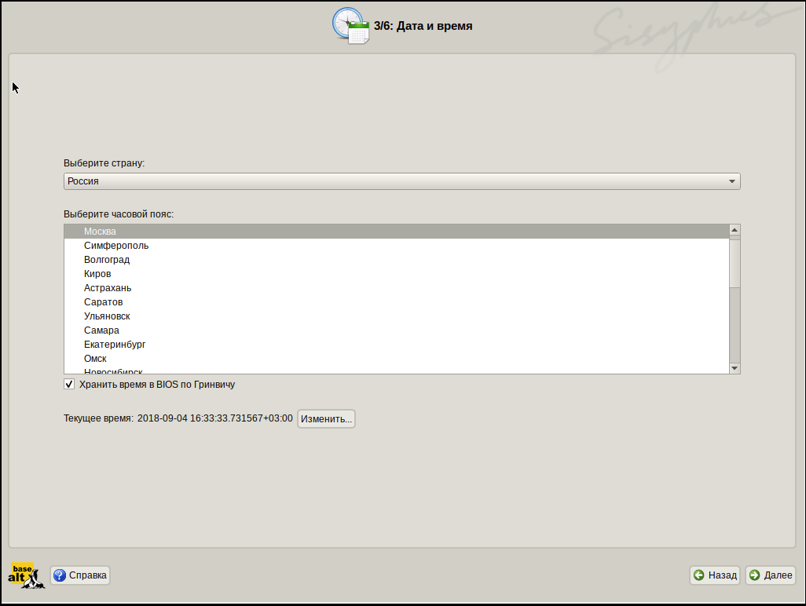

      Рис. 8

    - в появившемся окне **Администратор системы** (рис. 9) необходимо 
      дважды ввести пароль учетной записи системного администратора  
      и нажать кнопку **Далее**.
 
        !!! note "Примечания"
            1. Пароль может включать в себя строчные буквы, цифры и знаки пунктуации.
	          2. Длина пароля должна быть не менее восьми символов.
	          3. Пароль на экране отображается большими черными точками.
	          4. В дальнейшем в процессе эксплуатации в целях безопасности рекомендуется сменить пароль.

      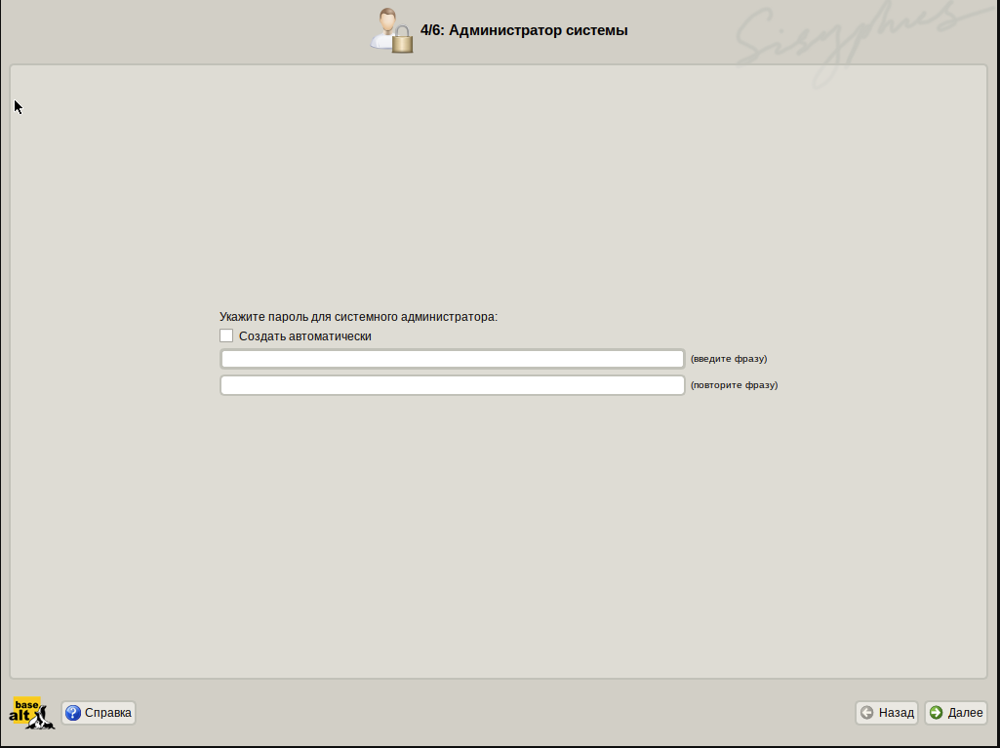

      Рис. 9

      Для автоматической генерации пароля необходимо установить флаг в 
      поле **Создать автоматически**. Система предложит пароль, сгенерированный 
      автоматическим образом в соответствии с требованиями по стойкости паролей;

    - в появившемся окне **Системный пользователь** (рис. 10) необходимо создать 
      учетную запись пользователя, для чего в поле **Имя** ввести имя пользователя, 
      а в поле **Комментарий** - комментарий к имени учетной записи. 
      Далее дважды ввести пароль учетной записи пользователя  и нажать кнопку **Далее**.

      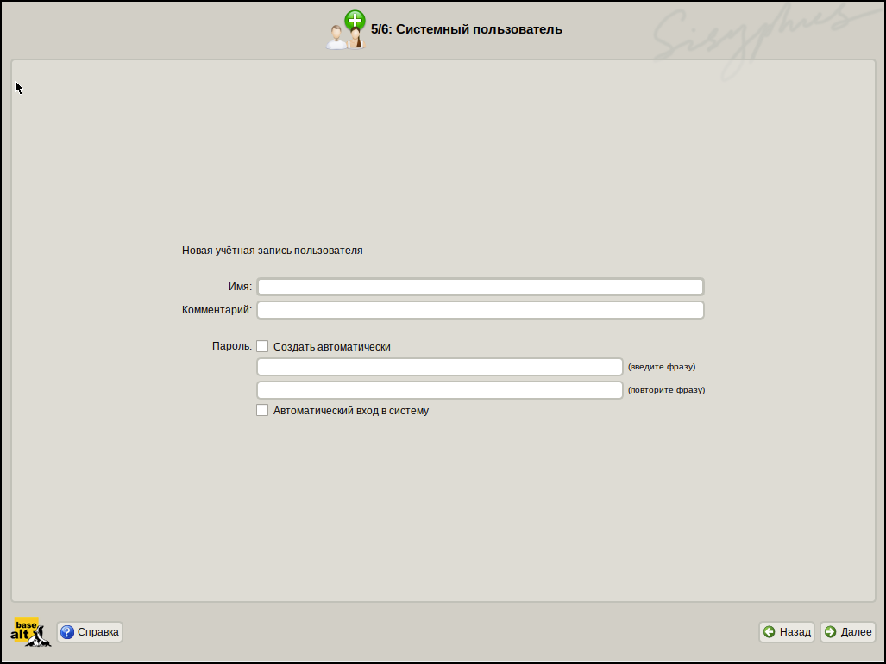

  	  Рис. 10

      Для автоматической генерации пароля необходимо установить флаг в поле 
      **Создать автоматически**. Система предложит пароль, сгенерированный автоматическим 
      образом в соответствии с требованиями по стойкости паролей.

      Для автоматического входа в систему необходимо установить флаг в 
     поле **Автоматический вход в систему**;

  	- в появившемся окне **Завершение настройки** (рис. 11) необходимо нажать кнопку **Завершить**;

      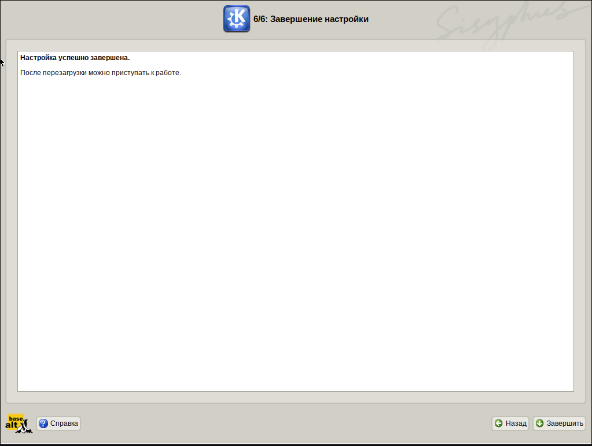

      Рис. 11

    - по окончании настройки произойдет автоматическая перезагрузка ОС.
