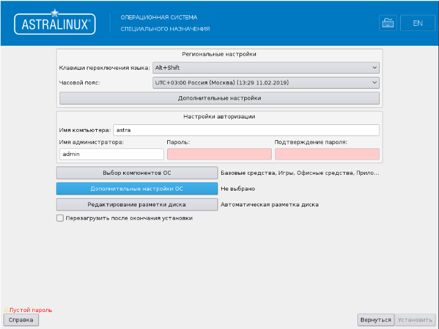
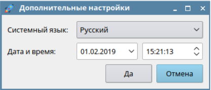
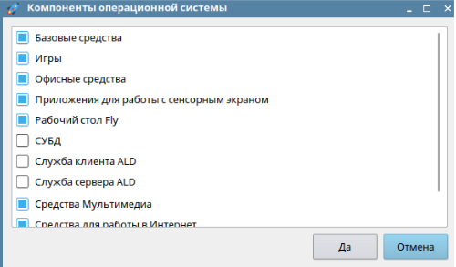
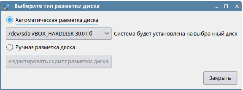

# Установка ОС *ASTRA LINUX SPECIAL EDITION*

Перед установкой ОС необходимо проверить контрольную сумму установочного 
компакт-диска ОС *Astra Linux Special Edition* версии 8.1 релиз *Ленинград* в соответствии с 3.7.1 формуляра 
РУСБ.10265-01 30 01.

Запуск программы установки ОС происходит в следующей последовательности:

- Подключить USB DVD-привод к терминалу МЦСТ Эльбрус 1С.

- Включить аппаратную платформу МЦСТ Эльбрус 1С и подключенный к ней монитор.

- Вставить установочный компакт-диск ОС в дисковод DVD-ROM.

- Дождаться загрузки терминала и запуска командной оболочки настройки.

- Для вызова подсказки по доступным командам нажать символ *h*.

- Для определения номера устройства, подключенного USB DVD-привода, нажать символ *d*. 
Нужное устройство будет отмечено как *ATAPI device*.

- Для изменения параметров загрузки и старта нажать символ *c*. 
Пользуясь клавишами *ENTER* (для перехода к следующей настройке) и *ESC* (для пропуска настройки) 
выполнить следующие действия:

   - ввести номер устройства, соответствующий *ATAPI device*;

   - ввести номер загрузочного раздела диска (disk partition или partition) равный *0* (ноль).

- Для продолжения загрузки с указанного устройства ввести символ *b*. Пользуясь клавишей *Tab* 
(вывод списка возможных носителей или дополнение названия по первым буквам) выбрать 
источник *Install_1c_Lenibgrad_DVD*, где 1с – тип процессора, а DVD – источник для установки.

- Далее начнется установка ОС. После запуска программы установки необходимо с помощью клавиш со стрелками на 
клавиатуре выбрать пункт меню *Графическая установка* и нажать клавишу **Enter**.

- На экране появится страница *Лицензия* с логотипом ОС вверху и выпадающим списком 
*Язык (language)* для установки языка интерфейса. Необходимо установить флаг в 
поле *Я принимаю лицензию* и нажать кнопку **Продолжить**.

- В появившемся окне (рис. 1) необходимо для каждого из предлагаемых параметров 
установить новое значение или принять значение *по умолчанию*.
 

Рис. 1

- В области *Региональные настройки* (см. рис. 1) необходимо выполнить следующие действия:

     - в поле *Клавиши переключения языка* необходимо из выпадающего списка выбрать 
       способ переключения клавиатуры *Alt+Shift*;

     - в поле *Часовой пояс* из выпадающего списка выбрать часовой пояс Москвы *UTC+03:00 Россия (Москва)*;

     - нажать кнопку *Дополнительные настройки* и в открывшемся окне (рис. 2) выбрать системный 
   язык (*по умолчанию* установлен *Русский*) и ввести дату и время. 
   Для подтверждения изменений нажать кнопку **Да**.

Рис. 2

- В области *Настройки авторизации* (см. рис. 1) необходимо выполнить следующие действия:

     - в поле *Имя компьютера* в строке ввести имя компьютера. Можно оставить 
       имя *по умолчанию* (или поменять, например, *astra*);

     - в поле *Имя администратора* в строке ввести имя учетной записи 
       администратора, например **sysadmin**. 

     !!! note "Примечание" 
         Учетная запись администратора должна начинаться со строчной латинской 
         буквы, за которой может следовать любое количество строчных латинских букв или цифр.

- В поле *Пароль* и *Подтверждение пароля* необходимо дважды ввести пароль *@SysAdmin*.

!!! note "Примечания"
    1. Пароль может включать в себя строчные буквы, цифры и знаки пунктуации.
    2. Длина пароля должна быть не менее восьми символов.
    3. Пароль на экране отображается большими черными точками.
    4. В дальнейшем в процессе эксплуатации в целях безопасности рекомендуется сменить пароль.

- Для выбора компонентов ОС необходимо нажать кнопку *Выбор компонентов ОС* (см. рис. 1). 
  Откроется окно (рис. 3), в котором необходимо выбрать *Базовые средства* и *Рабочий стол Fly* 
  и нажать кнопку **Да**.
 
 

Рис. 3

- Для редактирования разметки диска необходимо нажать кнопку *Редактирование разметки диска* 
(см. рис. 1). Откроется окно (рис. 4), в котором необходимо установить 
кнопку-переключатель *Автоматическая разметка диска* и из выпадающего списка 
выбрать соответствующий диск. Для подтверждения изменений нажать кнопку **Закрыть**.

Рис. 4

- Установить флаг *Перезагрузить после окончания установки* (см. рис. 1) и нажать кнопку **Установить**.

- В появившемся окне с предупреждением об удалении всех данных на устройствах, указанных 
при настройке разметки дисков, нажать кнопку **Да**. Начнется установка ОС с учетом выбранных настроек.

- По окончании установки ОС произойдет автоматическая перезагрузка ОС.

!!! note "Примечание" 
    После перезагрузки DVD-ROM должен автоматически извлечь установочный диск, 
    если этого не произошло, то извлечение диска необходимо сделать вручную.

