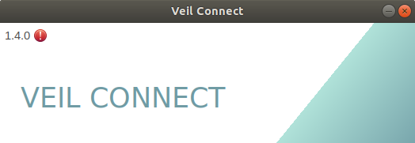
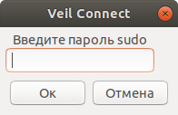
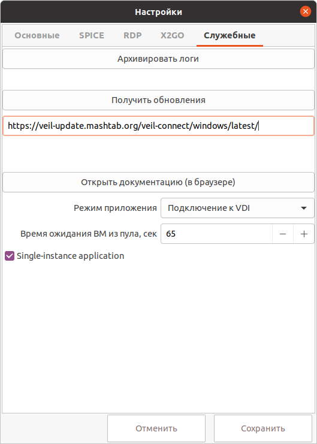

# Обновление VeiL Connect
Для обновления приложения достаточно установить новую версию поверх текущей.
Существует возможность автоматически проверить наличие новой версии, загрузить обновление и установить.

## Linux
### Debian-based OS
- Создайте файл `/etc/apt/sources.list.d/veil-connect.list` (от имени суперпользователя) и добавьте в него следующие строки:
- Для Debian 9:
```
deb [arch=amd64 signed-by=/usr/share/keyrings/veil-repo-key.gpg] https://veil-update.mashtab.org/veil-connect/linux/apt stretch main
```
- Для Debian 10:
```
deb [arch=amd64 signed-by=/usr/share/keyrings/veil-repo-key.gpg] https://veil-update.mashtab.org/veil-connect/linux/apt buster main
```
- Для Debian 11:
```
deb [arch=amd64 signed-by=/usr/share/keyrings/veil-repo-key.gpg] https://veil-update.mashtab.org/veil-connect/linux/apt bullseye main
```
- Для Ubuntu 16.04:
```
deb [arch=amd64 signed-by=/usr/share/keyrings/veil-repo-key.gpg] https://veil-update.mashtab.org/veil-connect/linux/apt xenial main
```
- Для Ubuntu 18.04:
```
deb [arch=amd64 signed-by=/usr/share/keyrings/veil-repo-key.gpg] https://veil-update.mashtab.org/veil-connect/linux/apt bionic main
```
- Для Ubuntu 20.04:
```
deb [arch=amd64 signed-by=/usr/share/keyrings/veil-repo-key.gpg] https://veil-update.mashtab.org/veil-connect/linux/apt focal main
```
- Для Ubuntu 22.04:
```
deb [arch=amd64 signed-by=/usr/share/keyrings/veil-repo-key.gpg] https://veil-update.mashtab.org/veil-connect/linux/apt jammy main
```
- Для Astra Linux Orel 2.12:
```
deb [arch=amd64 signed-by=/usr/share/keyrings/veil-repo-key.gpg] https://veil-update.mashtab.org/veil-connect/linux/apt bionic main
```
- Загрузите ключ проверки репозитория командой:
```
sudo wget -O /usr/share/keyrings/veil-repo-key.gpg https://veil-update.mashtab.org/veil-repo-key.gpg
```
- После этого выполните в терминале команду: `sudo apt-get update`.

- Для Centos 7 / Centos 8 cоздайте файл `/etc/yum.repos.d/veil-connect.repo` (от имени суперпользователя) и добавьте в него следующие строки:

    `name=VeiL Connect repository`  
    `baseurl=https://veil-update.mashtab.org/veil-connect/linux/yum/el$releasever/$basearch`  
    `gpgcheck=1`  
    `gpgkey=https://veil-update.mashtab.org/veil-connect/linux/yum/RPM-GPG-KEY-veil-connect`  
    `enabled=1`  

- После этого выполните в терминале команду: `sudo yum makecache`.

- Запустите **VeiL Connect**.

- В окне авторизации в верхнем левом углу рядом с номером версии приложения появится знак предупреждения
в случае, если была обнаружена новая версия.

!!! example "Пример"
    

- Нажмите **Настройки** -> **Служебные** -> **Получить обновления**.

- В открывшемся окне введите пароль sudo.

!!! example "Пример"
    

- Нажмите **Ок**. После этого, в случае наличия новой версии, произойдет ее загрузка и установка.

- Перезапустите **VeiL Connect**.


## Windows

- Запустите **VeiL Connect**.

- Нажмите **Настройки** -> **Служебные**.

- Введите путь к Windows хранилищу обновлений: `https://veil-update.mashtab.org/veil-connect/windows/latest/`

!!! example ""
    

- Нажмите кнопку **Получить обновления**. После этого, в случае наличия новой версии, произойдет ее загрузка и
запуск установщика приложения.

- Следуйте инструкциям установщика.

- Перезапустите **Veil Connect**.
