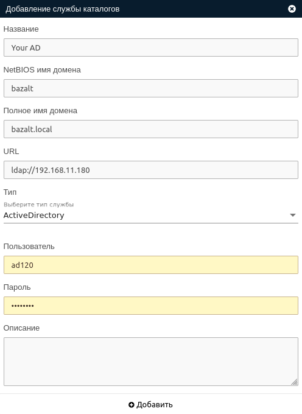

# Базовая интеграция

Базовая интеграция позволяет использовать службу каталогов как внешнюю службу авторизации.

!!! note "Примечание"
    Пользователю созданному в процессе интеграции запрещен вход в систему до тех пор, пока не будет выполнен сброс
    пароля администратором системы. После сброса пароля пользователь сможет выполнять вход как через MS AD, так и 
    с использованием локального пароля.

## Добавление службы каталогов

Добавление службы каталогов производится с помощью кнопки **Добавить службу каталогов** 
в разделе **Настройки -> Службы каталогов**. 

В открывшемся окне необходимо  заполнить следующие поля:
- Название
- Домен (записывается в формате domain)
- Класс объекта домена (записывается в формате domain.local)
- URL (записывается в формате ldap://xxx.xxx.xxx.xxx)

!!! example "Пример формы создания"
    
    
В результате будет создана запись в статусе **Исправно**, если статус другой - необходимо обратиться к разделу
**Журнал -> События**, где будет указана информация о проблеме.

## Добавление соответстия

!!! info ""
    Раздел соответствия предназначен для сопоставления системных ролей с атрибутами пользователей MS AD при входе в
    систему с использованием внешней службы авторизации. При успешной авторизации пользователю автоматически
    будут назначены Роли/Группы которые указаны в настройках соответствия.

!!! note "Примечание"
    Чтобы пользователь получил возможноть входа в панель администратора, группа, в которую он будет включен должна иметь
    1 или несколько системных ролей (SECURITY_OPERATOR, ADMINISTRATOR, OPERATOR), либо, пользователь должен иметь
    атрибут "Администратор". 

Добавление соответствия производится с помощью кнопки **Добавить соответствия** в разделе **Соответствия** созданной
ранее службы каталогов.
В открывшемся окне необходимо заполнить следующие поля:
- Выберите группу (локальная группа на брокере, в которую будет включен внешний пользователь)
- Приоритет (вес соответствия при коллизиях соответствий)
- Тип атрибута службы каталогов (тип атрибута объекта MS Active Directory)
- Значение атрибута службны каталогов (значение атрибута объекта MS Active Directory)

!!! example "Пример формы создания"
    