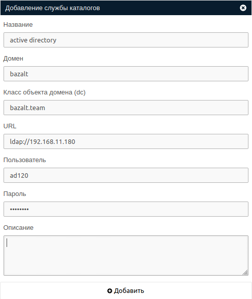

# Расширенная интеграция

Расширенная интеграция позволяет использовать службу каталогов как внешнюю службу авторизации, выполнять предварительную
синхронизацию пользователей, заводить ВРС на windows в домен.

!!! note "Примечание"
    Пользователю созданному в процессе интеграции запрещен вход в систему до тех пор, пока не будет выполнен сброс
    пароля администратором системы. После сброса пароля пользователь сможет выполнять вход как через MS AD, так и 
    с использованием локального пароля.

## Добавление службы каталогов

Добавление службы каталогов производится с помощью кнопки **Добавить службу каталогов** 
в разделе **Настройки -> Службы каталогов**. 

В открывшемся окне необходимо  заполнить следующие поля:
- Название
- Домен (записывается в формате domain)
- Класс объекта домена (записывается в формате domain.local)
- URL (записывается в формате ldap://xxx.xxx.xxx.xxx)
- Пользователь (учетная запись в MS AD с использованием которой будет выполняться синхронизация)
- Пароль

!!! example "Пример формы создания"
    
    
В результате будет создана запись в статусе **Исправно**, если статус другой - необходимо обратиться к разделу
**Журнал -> События**, где будет указана информация о проблеме.

!!! warning "Внимание"
    Обратите внимание на поле **Пользователь** - для авторизации на MS AD будет использована учетная запись
    по паттерну **Домен\Пользователь**, если **Пароль** или **Пользователь** не указан - попытка подключения будет 
    проигнорирована. Проверить корректность введенных данных можно кнопкой **Проверка соединения**.

## Добавление соответстия

!!! info ""
    Раздел соответствия предназначен для сопоставления системных ролей с атрибутами пользователей MS AD при входе в
    систему с использованием внешней службы авторизации. Каждому пользователю, который будету спешно авторизовываться
    автоматически будут назначены Роли/Группы которые указаны в настройках соответствия.

!!! note "Примечание"
    Чтобы пользователь получил возможноть входа в панель администратора, группа, в которую он будет включен должна иметь
    1 или несколько системных ролей (SECURITY_OPERATOR, ADMINISTRATOR, OPERATOR), либо, пользователь должен иметь
    атрибут "Администратор". 

Добавление соответствия производится с помощью кнопки **Добавить соответствия** в разделе **Соответствия** созданной
ранее службы каталогов.
В открывшемся окне необходимо заполнить следующие поля:
- Выберите группу (локальная группа на брокере, в которую будет включен внешний пользователь)
- Приоритет (вес соответствия при коллизиях соответствий)
- Тип атрибута службы каталогов (тип атрибута объекта MS Active Directory)
- Значение атрибута службны каталогов (значение атрибута объекта MS Active Directory)

!!! example "Пример формы создания"
    

## Синхронизация пользователей группы MS AD

Синхронизация группы позволит единомоментно перенести всех пользователей-членов группы MS AD в локальную систему.

!!! note ""
    Повторная синхронизация ранее синхронизированной группы исключит из нее пользователей, которых в ней больше нет
    и добавит пользователей, которые небыли синхронизированы ранее.

Добавление группы пользователей производится с помощью кнопки **Добавить группу** в разделе **Группы** созданной
ранее службы каталогов. В появившемся окне необходимо выбрать требуюмую группу - в дальнейшем из неё будут синхронизированы
все пользователи.

### Шаги синхронизации группы MS AD

Процесс синхронизации делится на 2 шага:

- Получение групп доступных для синхронизации
    Группы доступные для синхронизации формируются из списка все объектов с категорией **ГРУППА** не являющиеся критичными 
    системными объектами и имеющие атрибут **Глобальная группа безопасности** за исключением групп ранее синхронизированных 
    на VDI.
  
    !!! note ""
        Если список групп пустой, проверьте параметры учетной записи указанной для службы каталогов.

- Выбор конкретной группы и получение ее членов
    Одномоментно можно синхронизировать только 1 группу. Это сделано в целях снижения нагрузки на MS AD. 
    Пользователи доступные для синхронизации формируются из списка объектов с категорией **ПОЛЬЗОВАТЕЛЬ** или 
    **ПЕРСОНА**, классом **ПОЛЬЗОВАТЕЛЬ** не имеющие статус **ЗАБЛОКИРОВАН** и состоящих в выбранной группе.

!!! info "Фильтры используемые при построении списка групп"
    `(&(objectCategory=GROUP)(groupType=-2147483646)(!(isCriticalSystemObject=TRUE))`

!!! info "Фильтры используемые при построении списка пользователей"
    ```
    base_filter = '(&(sAMAccountName=*)'
    locked_account_filter = '(!(userAccountControl:1.2.840.113556.1.4.803:=2))'
    persons_filter = '(|(objectCategory=USER)(objectCategory=PERSON))(objectClass=USER)'
    member_of_filter = '(memberOf={})'.format(groups_cn)
    final_filter = ''.join([base_filter, locked_account_filter, persons_filter, member_of_filter, ')'])
    ```

## Подготовка ВМ

Если в системе существует активная служба каталогов с расширенной интеграцией, а так же образ ВМ основан на ОС Windows
существует возможность автоматизации процесса ввода ВМ в домен и включение заведенных компьютеров в группы MS AD.

!!! info ""
    Автоматическая подготовка ВМ требует как **настройки брокера**, так и подготовки **эталонного образа** из которого будут
    создаваться новые ВМ. Более детально процесс рассмотрен в [профильном разделе](./ad_vm_prepare.md).