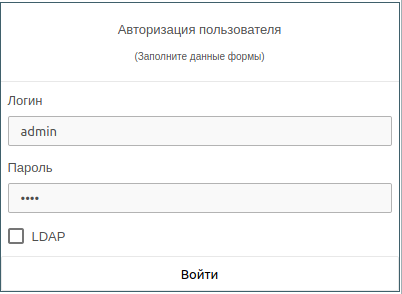

# Система авторизации

## Вход в систему

Вход в систему возможен двумя способами:
- С использованием локальной учетной записи (переключатель **LDAP** выключен).
- С использованием внешней учетной записи (переключатель **LDAP** включен).

!!! example "Вход в систему с использованием локальной учетной записи"
        

!!! note "Внешние учетные записи"
    Для использования внешних учетных записей необходимо настроить интеграцию с [Службой каталогов](../active_directory/info.md).
    При успешном входе с использованием внешней учетной записи будет создан локальный профиль.
    После процедуры сброса пароля его можно будет использовать как локальную учетную запись. 

!!! info "Активные сессии"
    Одновременно у пользователя может быть только 1 активная сессия. После прохождения процедуры аутентификации ранее
    выданные сессионные ключи блокируются (уникальность считается по пользователю, независимо от
    типа подключения).

## Модель разрешений

Модель разрешений состоит из 3 ключевых моментов:
- [Роли](./roles.md)
- [Группы](./groups.md)
- [Пользователи](./users.md)

!!! note "Ключевые моменты"
    Взаимоисключающие разрешения исключены. Роль **пользователя** всегда имеет преимущество над ролью **группы**.
    Итоговые роли пользователя формируются из пересечения пользовательских и всех групповых ролей пользователя.
    Переключатель **Администратор** дает пользователю обладание всеми возможными ролями в системе, 
    независимо от фактически назначенных ролей на него или его группы. Используйте такие типы пользователя с 
    осторожностью, их поведение аналогично **root**.
