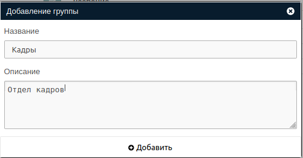
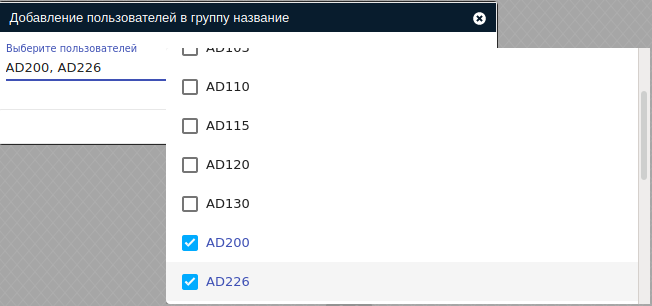
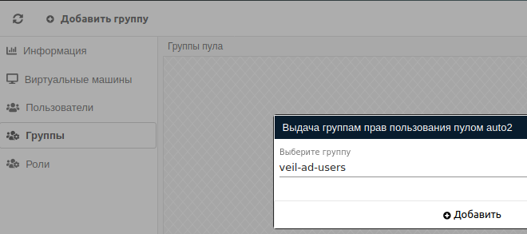

# Группы

**Группы** это ключевая группирующая сущность в системе и предназначена для обобщения владения объектами.
Описанные ниже группы это только группы самого брокера не имеющие отношения к ОС (PAM).

!!! warning "Внимание"
    Пользователю с атрибутом **Администратор** не нужно находиться в группе, чтобы иметь доступ к ее объектам.

## Добавление группы

!!! note ""
    Группа может быть создана с помощью синхронизации. Описание находится в 
    [соответствующем разделе](../active_directory/ad_extend.md).

Добавление группы производится с помощью кнопки **Добавить группу** в разделе **Настройки -> Группы**.
В открывшемся окне необходимо заполнить следующие поля:
- Название (обязательное поле)
- Описание (необязательное поле)

!!! example "Пример формы создания"
    

## Информация о группе

В информации группы доступно число пользователей состоящих в группе. Нахождение в группе дает пользователю доступ 
к ее объектам и **ролям**.
Чтобы включить пользователя в группу необходимо нажать кнопку **Добавить пользователя** в разделе **Пользователи**
ранее созданной группы.

!!! example "Пример включения пользователя в группу"
    

!!! note ""
    Пользователь может быть включен в группу в результате синхронизации со службой каталогов. Подробности описаны в 
    [соответствующем разделе](../active_directory/info.md)

Закрепление [Роли](./roles.md) за **Группой** производится аналогично, в разделе **Роли**

## Владение объектами

Чтобы закрепить конкретный объект в системе за **группой** необходимо перейти в информацию об объекте и в разделе 
**Группы** нажать кнопку **Добавить роль**.

!!! example "Пример закрепления пула за группой"
    
