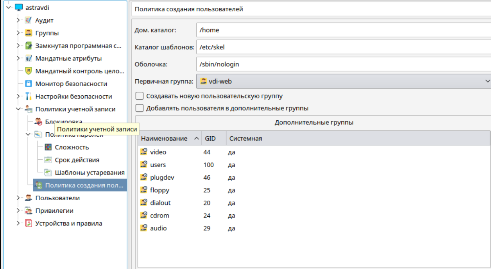

# Установка VeiL Broker 3.0.X

## Подготовка к установке

### Создание ВМ

#### Рекомендованные требования к ВМ

**CPU / **CPU PRIORITY** - 4 / HIGH

**RAM / **VDISK** - 4 / 40 GB 

!!! info "Проблемы с мышкой с подключением по SPICE"
    Если после установки в ВМ возникают проблемы с мышкой:
    1. Попробуйте обновить spice-vdagent до более актуальной версии (spice-vdagent_0.18.0-1_amd64)
    2. Если не помог пункт 1, попробуйте выключить ВМ, сменить графический адаптер на **qxl**,
       добавить новый USB2.0 контроллер *ehci*, удалить базовый USB3.0 контроллер *nec xhci* 
       и включить ВМ.

### Установка системы 

1. Выбирая имя учётной записи администратора нужно иметь в виду, что имя **vdiadmin** будет в дальнейшем 
   использовано брокером, поэтому необходимо выбрать другое имя, например, **astravdi**.

1. Выбирая компоненты системы обязательно должны быть выбраны **Базовые средства** и 
   **Средства удаленного доступа SSH**, желательно выбрать **Рабочий стол Fly**.

1. После завершения установки войдите в систему указав значение **Integrity level** равное **63** или 
   **Уровень целостности** равное **Высокий** (для графического режима).

1. Подключить iso-образ **основного** диска Astra Linux Smolensk 1.6, выполнить команды для копирования 
   deb-пакетов в систему:
```
sudo mount /media/cdrom
sudo mkdir /opt/main
sudo cp -r /media/cdrom/pool /media/cdrom/dists /opt/main/
sudo umount /media/cdrom
```

1. Подключить iso-образ **devel** диска Astra Linux Smolensk 1.6, выполнить команды для 
   копирования deb-пакетов в систему
```
sudo mount /media/cdrom
sudo mkdir /opt/devel
sudo cp -r /media/cdrom/pool /media/cdrom/dists /opt/devel/
sudo umount /media/cdrom
```

1. Настроить локальный apt-репозиторий, приведя файл **/etc/apt/sources.list** к виду
```
deb file:///opt/main smolensk contrib main non-free
deb file:///opt/devel smolensk contrib main non-free
```

1. Обновить списки пакетов командой `sudo apt-get update`
   
### Установка брокера

1. Подключить iso-образ **VeiL Broker**
   и выполнить команды для установки
```
sudo mount /media/cdrom
cd ~
sudo bash /media/cdrom/install.sh
sudo umount /media/cdrom
```

1. Установка выполняется около 5 мин, после установки Web-интерфейс VeiL Broker будет доступен по 
   https://server_ip_address. Пользователь и пароль по умолчанию - **vdiadmin - Bazalt1!**

1. Войти в *Панель управления* → *Безопасность* → *Политика безопасности* → *Политики учетной записи* и 
   выполнить настройки создания новых пользователей
   - *Политика создания пользователей* и в качестве первичной группы указать **vdi-web**, а в качестве оболочки 
     **/sbin/nologin**. Снять переключатели *Создавать новую пользовательскую группу* и 
     *Добавлять пользователя в дополнительные группы*
     
   - Войти в раздел *Политики учетной записи* → *Политика паролей* и активировать переключатель 
     *Применять для пользователя root*
     

### Настройка PAM
Pluggable Authentication Modules (PAM, подключаемые модули аутентификации) — это набор разделяемых библиотек, 
которые позволяют интегрировать различные низкоуровневые методы аутентификации в виде единого высокоуровневого API.
При стандартной установке VeiL Broker параметр **PAM_AUTH** включен, что позволяет переложить функции локальной службы
авторизации на Astra linux в котором выполнена установка. Сам процесс настройки **PAM** в системе не является
параметрами VeiL Broker, однако, за основу можно взять следующий пример:

!!! example "/etc/pam.d/common-auth"
    ```
    # force vdi-web check
    auth required pam_succeed_if.so user ingroup vdi-web
    ```    

!!! example "/etc/pam.d/login"
    ```
    # change default delay
    auth optional pam_faildelay.so delay=1000000
    ```

!!! warning "Предупреждение"
    Не забудьте добавить в указанную группу пользователя под которым выполняется вход в GUI для администрирования.

Дальнейшее описание работы с системой авторизации доступно по [ссылке](../auth/info.md).
