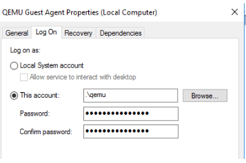
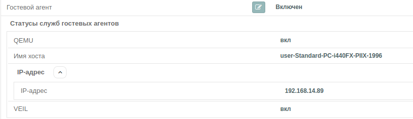

# Гостевой агент

#### Загрузка образа.

Образ содержит пакеты для ОС Linux и Windows. Включает в себя *qemu_guest_agent*, *virtio драйвера* и 
утилиты для *SPICE*.

[Образ с драйверами](https://veil-update.mashtab.org/files/veil-guest-utils/)

#### Состав образа

- **Spice guest tools** - этот установщик содержит некоторые дополнительные драйверы и службы, которые 
можно установить в гостевой системе Windows для повышения производительности и интеграции SPICE.
Это включает видеодрайвер qxl и гостевой агент SPICE (для копирования и вставки, автоматического переключения разрешения и т.д.)
Все драйверы которые будут доступны при установке указаны ниже в Virtio guest tools.

- **Spice vdagent** - необязательный компонент, улучшающий интеграцию окна гостевой системы с графическим интерфейсом удалённого пользователя. 
SPICE-протокол поддерживает канал связи между клиентом и агентом на стороне сервера. Агент работает внутри гостевой системы. 
Для связи с агентом в гостевой системе также используется специальное устройство, так называемый VDI-порт.

- **Spice webdavd** - служба, которая использует протокол WebDAV для предоставления общего доступа к файлам ВМ.

- **Virtio guest tools** - этот установщик содержит некоторые дополнительные драйверы и службы, которые можно установить в гостевой системе:

    - **NetKVM** — Virtio сетевой драйвер;    
    - **viostor** — Virtio блочный драйвер;           
    - **vioscsi** — Virtio драйвер интерфейса SCSI;     
    - **viorng** — Virtio RNG (генератор случайных чисел) драйвер;        
    - **vioser** — Virtio serial driver (Он предоставляет несколько портов гостю в виде 
        простых символьных устройств для простого ввода-вывода между гостевым и хостовым пользовательскими 
        пространствами. Это также позволяет открывать несколько таких устройств, 
        снимая ограничения на одно устройство.);
    - **Balloon** — Virtio memory balloon driver («Баллонное устройство» virtio позволяет 
        гостям KVM уменьшить объем своей памяти (тем самым освободив память для хоста) 
        и увеличить ее обратно (тем самым забрав память у хоста));   
    - **qxl** — QXL графический драйвер для Windows 7 и ниже;     
    - **qxldod** — QXL графический драйвер для Windows 8 и выше;    
    - **pvpanic** — драйвер устройства QEMU pvpanic (устройство pvpanic - это смоделированное устройство ISA);    
    - **guest-agent** — Qemu Guest Agent 32bit and 64 bit  MSI installers;    
    - **qemupciserial** —  драйвер QEMU PCI;
  
#### Другие варианты скачивания VirtIO Drivers

Обычно драйверы довольно стабильны, поэтому сначала следует попробовать самый последний выпуск.

[Последние драйвера virtio](https://fedorapeople.org/groups/virt/virtio-win/direct-downloads/latest-virtio/virtio-win.iso)

[Стабильные драйвера virtio](https://fedorapeople.org/groups/virt/virtio-win/direct-downloads/stable-virtio/virtio-win.iso)

#### Монтирование образа.

- После загрузки образа в VeiL монтируйте образ к ВМ и через стандартные установщики поставьте
необходимое ПО в ВМ.

#### Настройка qemu-guest-agent.

После установки qemu агента, создайте **административную** локальную учетную запись, 
откройте службы windows и настройте запуск службы qemu агент не от local system, 
а от ранее созданной УЗ. Следует помнить, что при блокировании пароля данной учетной записи,
служба гостевого агента не будет работать.

!!! note "Примечание"
    Необходимо для автоматического ввода ВМ в AD.

#### Проверка связи Veil c гостевым агентом.

- Удостоверьтесь, что связь с qemu_guest_agent есть во вкладке **Информация** ВМ.

#### Установка hostname.

- Во вкладке **ВМ/Шаблон** ВМ при активном гостевом агенте можно установить hostname ВМ. 

!!! note "Примечание"
    Для разных ОС установка hostname происходит по-разному.
    Для Windows через _powershell_ командой `Rename-Computer` с последующей перезагрузкой для принятия изменений.
    Для Linux командой `/usr/bin/hostnamectl` при включенной ВМ.
    Для Linux утилитой `virtsysprep` с сервера при выключенной ВМ.
    
#### Windows Sysprep.

- Для подготовки шаблона с ОС Windows можно использовать утилиту Sysprep.

- Во вкладке **ВМ/Шаблон** ВМ при включенной ВМ и активном гостевом агенте нажмите кнопку **Sysprep**. 

- Можно выбрать стандартные опции утилиты sysprep.

#### Linux virt-sysprep.

- Для подготовки шаблона с ОС Linux можно использовать утилиту *virt-sysprep*.

- Во вкладке **ВМ/Шаблон** ВМ при выключенной ВМ нажмите кнопку **VirtSysprep** и выберите при желании
  загрузочный диск. 

- Можно выбрать стандартные опции утилиты *virt-sysprep*.

#### Добавление в AD.

- Во вкладке **ВМ/Шаблон** ВМ при активном гостевом агенте можно добавить ВМ в AD,
указав:
    - hostname (необязательный параметр);
    - имя домена; 
    - логин;
    - пароль;
    - опция рестарта после применения параметров (по умолчанию включено).

!!! note "Примечание"
    Не забудьте прописать DNS домена или настройте DHCP.

#### Удаление из AD.

- Во вкладке **ВМ/Шаблон** ВМ при активном гостевом агенте можно убрать ВМ из AD, указав:
    - логин;
    - пароль.

#### Изменить шаблон.

Способ изменить шаблон без ручного пересоздания всех клонов
это воспользоваться операцией вливания снимка тонкого клона в шаблон.

Для этого требуется подготовить тонкие клоны с панели ECP VeiL:

- На всех тонких клонах не должно быть сохраненных состояний, требуется при необходимости зайти
 в снимки и **Удалить все состояния**.
 
- Внести нужные изменение в имеющийся тонкий клон или создать новый тонкий клон и произвести там изменения.

- Выключить все включенные тонкие клоны от родительского шаблона.

- Для ОС Windows рекомендуется перед вливанием подготовить тонкий клон через sysprep,
  если вы использовали для шаблона.
  
- Произвести операцию в тонком клоне, который мы подготовили для вливания в шаблон,
 нажав во вкладке **ВМ/Шаблон** кнопку **Изменить шаблон** и подтвердив свои намерения в открывшемся окне.

Эти действия внесут изменения из подготовленного тонкого клона в диски шаблона,
и от них пересоздадутся диски во всех остальных тонких клонах.

!!! warning "Внимание"
    Изменение шаблона напрямую при наличии тонких клонов запрещено, так как это приведет в нерабочее
    состояние все тонкие клоны. 