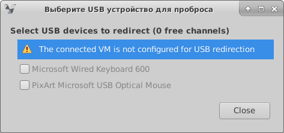

# Возможные ошибки при подключении по Spice

### Ошибка The connected VM is not configured for USB redirection

!!! example ""
    

Решение:

 - В Web-интерфейсе ECP VeiL соответствующей ВМ необходимо добавить USB Spice канал и USB контроллер nec-xhci (USB3.0)
 См. [Настройки для возможности перенаправления USB (Spice и RDP)](../veil_connect.md)